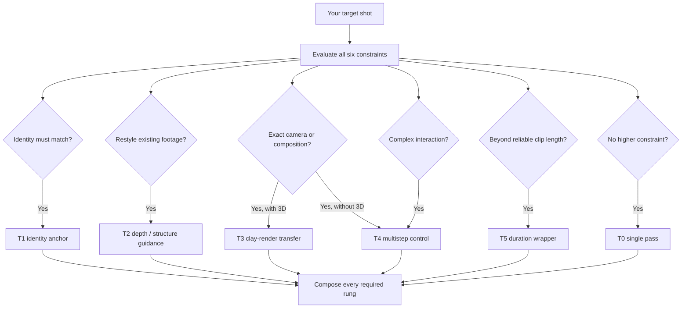

# AIGC-Tech

**A decision-first multistep video playbook. Stop asking "which model is best?" Start
asking "which technique does this shot need?"**

A decision-first field guide to multi-step AIGC video production: clay-render transfer
(白模迁移), depth-guided video, multistep compositing (background → subject → merge,
with surgical ComfyUI passes in between), and long-take chaining for minutes-long
one-shots — plus agent-loadable skills that route your target frame to the right pipeline.

[中文 README](README.zh-CN.md) · [Decision Framework](docs/en/00-decision-framework.md) · [Skills](#agent-skills) · [Contributing](CONTRIBUTING.md)

[](LICENSE)
[](docs/)
[](skills/)
[](CONTRIBUTING.md)

---

## Why this repo exists

Most AIGC video tutorials are tool tutorials: "here's how to use Kling / Runway /
ComfyUI." That is the wrong starting point. The question that actually determines
whether your shot succeeds is:

> **Given my target frame — its duration, its consistency demands, its camera, its
> interactions — which *technique* should I pay for?**

A single prompt that demands character identity + precise camera + style + 30s duration
+ environment interaction fails most of the time. Not because models are bad, but
because one sampling pass cannot satisfy six constraints at once. **Multi-step AIGC
spends the complexity budget one dimension at a time** — generate the background, then
the character, denoise in ComfyUI, then merge. Each approved artifact becomes a frozen
input, so a downstream failure can be retried without throwing away everything upstream.

This repo is the routing layer: a decision framework, per-technique playbooks, and
skills that let an agent do the routing for you.

## The 60-second version



Full composable routing map, scenario table, and escalation rules:
**[docs/en/00-decision-framework.md](docs/en/00-decision-framework.md)**

## Documentation

| # | Doc (EN) | 中文 | What it answers |
|---|----------|------|-----------------|
| 00 | [The Decision Framework](docs/en/00-decision-framework.md) | [决策框架](docs/zh/00-decision-framework.md) | Which technique for your target frame — start here. |
| 01 | [Clay-Render Transfer (白模迁移)](docs/en/01-clay-render-transfer.md) | [白模迁移](docs/zh/01-clay-render-transfer.md) | Lock geometry with a 3D blockout, restyle with AI. |
| 02 | [Depth-Guided Video](docs/en/02-depth-video.md) | [深度视频](docs/zh/02-depth-video.md) | Per-frame depth as the steering wheel for v2v and restyle. |
| 03 | [Multistep Video Generation](docs/en/03-multistep-video-generation.md) | [多步骤视频生成](docs/zh/03-multistep-video-generation.md) | Background plate → subject → merge, with ComfyUI passes between steps. |
| 04 | [Long-Take Chaining (一镜到底)](docs/en/04-long-take-continuous-shot.md) | [长镜头一镜到底](docs/zh/04-long-take-continuous-shot.md) | Minutes-long continuous shots via overlapping segments + anchors. |
| 05 | [ComfyUI Integration Patterns](docs/en/05-comfyui-integration.md) | [ComfyUI 集成模式](docs/zh/05-comfyui-integration.md) | Denoise, relight, latent-merge, upscale — the workbench between steps. |
| 06 | [Pipeline Recipes](docs/en/06-pipeline-recipes.md) | [管线配方](docs/zh/06-pipeline-recipes.md) | End-to-end worked examples combining the techniques. |

## Agent Skills

Loadable by Claude Code, Kimi, and other Agent-Skills-compatible tools. Each skill
packages the routing logic so an agent can plan your pipeline instead of guessing.

| Skill | What it does |
|-------|--------------|
| [aigc-technique-router](skills/aigc-technique-router/SKILL.md) | Interviews you about the target shot (the six routing questions) and returns a recommended pipeline with rationale. |
| [multistep-video-planner](skills/multistep-video-planner/SKILL.md) | Turns a shot description into a step-by-step multistep plan: plates, passes, merge points, QA gates. |
| [comfyui-denoise-pass](skills/comfyui-denoise-pass/SKILL.md) | Designs the mid-pipeline denoise/relight pass: strength ranges, node order, failure checks. |

## Validate the playbook

The routing cases, bilingual structure, local links, Skill metadata, and repository
claims are checked without third-party dependencies:

```bash
npm test
```

## Repo layout

```
├── docs/en, docs/zh      # the playbook, mirrored in English and Chinese
├── skills/               # agent-loadable skills (SKILL.md format)
├── scripts/              # executable reference implementation of the routing rules
├── tests/                # routing cases and repository consistency checks
├── workflows/            # contribution contract; executable examples are not committed yet
├── assets/               # reserved for future stills; current diagrams use Mermaid in docs
└── CONTRIBUTING.md       # how to add a technique or update the routing logic
```

## Principles

1. **Technique before tool.** Models change monthly; routing logic survives them.
2. **Cheapest rung first.** Always try single-pass before building a pipeline.
3. **Name the failing constraint** before escalating one dimension at a time.
4. **Freeze approved artifacts.** Never regenerate upstream of a step you approved.
5. **Document failure modes.** Knowing when a technique is wrong is half the playbook.

## License

[MIT](LICENSE) — use it, fork it, ship shots with it.
