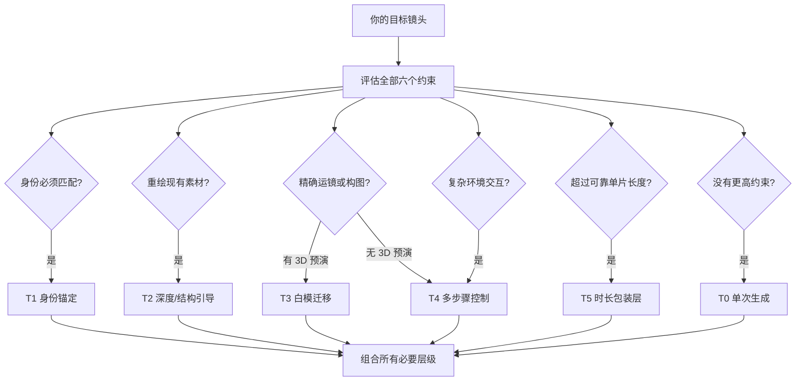

# AIGC-Tech

**一本决策优先的多步骤视频实战手册。先选择技术，再编译运动，最后生成镜头。**

一本决策优先的多步骤 AIGC 视频制作实战指南:白模迁移、深度引导视频、
多步骤合成(先生成背景 → 再生成人物 → 合并,中间穿插 ComfyUI 手术式处理)、
分钟级一镜到底的链式拼接，以及运动优先的提示词编译——外加可直接被 agent
加载的 skill，让 agent 把目标画面路由到正确流水线，并将导演意图编译成
可执行的视频指令。

[English README](README.md) · [决策框架](docs/zh/00-decision-framework.md) · [Skills](#agent-skills) · [贡献指南](CONTRIBUTING.md)

[](LICENSE)
[](docs/)
[](skills/)
[](CONTRIBUTING.md)

---

## 为什么会有这个仓库

大多数 AIGC 视频教程都是工具教程:"教你用 Kling / Runway / ComfyUI"。
这是错误的起点。真正决定你的镜头成败的问题是:

> **给定我的目标画面——它的时长、一致性要求、运镜、交互——我该为哪种*技术*付费?**

一条同时要求角色身份 + 精确运镜 + 风格 + 30 秒时长 + 环境交互的提示词,
大多数时候都会失败。不是模型不行,而是一次采样无法同时满足六个约束。
**多步骤 AIGC 一次只花一个维度的复杂度预算**——先生成背景,再生成人物,
中间进 ComfyUI 降噪,最后合并。每个验收通过的产物都会冻结为下一步的输入,
下游失败时只重试当前步骤,不用把上游全部推倒重来。

这个仓库是控制层:一套决策框架、按技术分类的实战手册,
以及让 agent 完成镜头路由、步骤规划和提示词编译的 skill。

## 60 秒速览



完整可组合路由图、场景表和升级纪律:
**[docs/zh/00-decision-framework.md](docs/zh/00-decision-framework.md)**

## 文档目录

| # | 文档(中文) | English | 回答什么问题 |
|---|-----------|---------|--------------|
| 00 | [决策框架](docs/zh/00-decision-framework.md) | [Decision Framework](docs/en/00-decision-framework.md) | 目标画面该用哪种技术——从这里开始。 |
| 01 | [白模迁移](docs/zh/01-clay-render-transfer.md) | [Clay-Render Transfer](docs/en/01-clay-render-transfer.md) | 用 3D 白模锁死几何,用 AI 重绘风格。 |
| 02 | [深度视频](docs/zh/02-depth-video.md) | [Depth-Guided Video](docs/en/02-depth-video.md) | 逐帧深度图是视频迁移与风格化的方向盘。 |
| 03 | [多步骤视频生成](docs/zh/03-multistep-video-generation.md) | [Multistep Video Generation](docs/en/03-multistep-video-generation.md) | 背景板 → 主体 → 合并,步骤之间穿插 ComfyUI 处理。 |
| 04 | [长镜头一镜到底](docs/zh/04-long-take-continuous-shot.md) | [Long-Take Chaining](docs/en/04-long-take-continuous-shot.md) | 重叠分段 + 连续性锚点,拼出分钟级长镜头。 |
| 05 | [ComfyUI 集成模式](docs/zh/05-comfyui-integration.md) | [ComfyUI Integration Patterns](docs/en/05-comfyui-integration.md) | 降噪、重打光、潜空间合并、超分——步骤之间的工作台。 |
| 06 | [管线配方](docs/zh/06-pipeline-recipes.md) | [Pipeline Recipes](docs/en/06-pipeline-recipes.md) | 组合多种技术的端到端完整案例。 |
| 07 | [运动优先的提示词编译](docs/zh/07-motion-first-prompt-compilation.md) | [Motion-First Prompt Compilation](docs/en/07-motion-first-prompt-compilation.md) | 把导演意图、参考图和模型反馈转化成可执行提示词。 |

## Agent Skills

可被 Claude Code、Kimi 及其他兼容 Agent Skills 规范的工具加载。
每个 skill 把路由逻辑打包,让 agent 替你规划流水线而不是瞎猜。

| Skill | 作用 |
|-------|------|
| [aigc-technique-router](skills/aigc-technique-router/SKILL.md) | 用六个路由问题访谈你的目标镜头,输出带理由的流水线推荐。 |
| [multistep-video-planner](skills/multistep-video-planner/SKILL.md) | 把镜头描述变成分步执行计划:背景板、中间处理、合并点、质检门。 |
| [comfyui-denoise-pass](skills/comfyui-denoise-pass/SKILL.md) | 设计管线中段的降噪/重打光步骤:强度区间、节点顺序、失败检查项。 |
| [compile-video-prompt](skills/compile-video-prompt/SKILL.md) | 把导演意图与有明确类型的参考图编译成一段运动优先提示词和紧凑的 Negative。 |

## 验证手册

路由案例、中英文档结构、本地链接、Skill 元数据和仓库描述都可以通过零依赖测试检查:

```bash
npm test
```

## 仓库结构

```
├── docs/en, docs/zh      # 手册正文,中英双语镜像
├── skills/               # agent 可加载的 skill(SKILL.md 格式)
├── scripts/              # 路由规则的可执行参考实现
├── tests/                # 路由案例与仓库一致性检查
├── workflows/            # 工作流贡献约定;暂未提交可执行示例
├── assets/               # 预留静帧目录;当前示意图直接用 Mermaid
└── CONTRIBUTING.md       # 如何新增技术条目或更新路由逻辑
```

## 原则

1. **技术先于工具。** 模型每月都在换,路由逻辑比模型活得久。
2. **永远先试最便宜的阶梯。** 搭流水线之前,先给单次生成 15 分钟。
3. **升级前先说出是哪个约束失败了**,一次只升一个维度。
4. **冻结已验收的产物。** 绝不在下游重新生成已批准步骤的上游输入。
5. **记录失败模式。** 知道什么时候*不该*用某项技术,是手册的一半价值。
6. **编译意图,不要堆形容词。** 先表达摄影机、主体和场景运动,最后才写影调。

## License

[MIT](LICENSE)——随便用,随便 fork,拿去出片。
