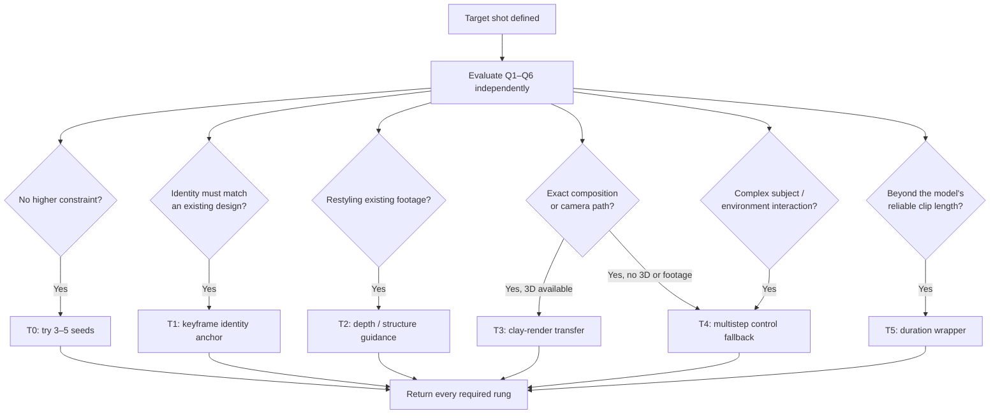

# 00 — The Decision Framework: Which Technique for Your Target Frame?

> **The core thesis of this repo:** do not start from the tool you like. Start from the
> shot you need. Decompose the target frame into requirements, then route to the
> simplest pipeline that satisfies them. Every extra demand you pile into a single
> generation multiplies the failure rate.

[中文版本](../zh/00-decision-framework.md)

---

## 1. The Complexity Budget

Every video generation model has an implicit **complexity budget** per pass. A single
prompt that simultaneously demands:

- a specific character identity, **and**
- a precise camera move, **and**
- a specific style, **and**
- exact composition, **and**
- 30+ seconds of duration, **and**
- clean interaction between subject and environment

…will fail far more often than it succeeds. Not because the model is bad, but because
you asked one sampling pass to satisfy six constraints at once.

**Multi-step AIGC exists to spend the budget one dimension at a time.** Generate the
background without worrying about the character. Generate the character without
worrying about the background. Denoise, upscale, or restyle in between. Composite at
the end. Each pass carries one or two constraints, and every approved artifact becomes
a frozen input. A failed downstream pass can then be retried locally instead of forcing
the whole shot to be regenerated.

The cost is orchestration: more steps, more intermediate artifacts, more places to
drift. This framework tells you when that cost is worth paying.

## 2. The Six Routing Questions

Answer these about your **target frame/shot** before touching any tool:

| # | Question | Why it routes |
|---|----------|---------------|
| Q1 | How long is the final shot? | Going beyond the chosen model's verified reliable clip length adds T5; do not hard-code a universal 10s limit. |
| Q2 | Must the subject stay *identical* across shots/frames? | Character consistency is the #1 reason to split generation into steps. |
| Q3 | Do you need exact control of composition/camera? | "Exact" means structural guidance (depth, clay render, 3D previz), not prompt engineering. |
| Q4 | Does the subject interact with the environment (contact shadows, occlusion, reflections)? | Required interaction adds T4; structural guidance from Q3/Q5 may still compose with it. |
| Q5 | Is the target realistic, stylized, or a restyle of existing footage? | Restyle → video-to-video. From scratch → text/image-to-video. |
| Q6 | What is your compute/time budget per final second? | Cost compounds across passes, retries, overlap, and human QA. Estimate those inputs instead of quoting one universal multiplier. |

## 3. The Technique Ladder

Ordered from cheapest (try first) to most orchestrated (use when cheaper rungs fail).
Full details in the linked docs.

| Rung | Technique | Role | Doc |
|------|-----------|------|-----|
| **T0** | Single-pass text-to-video | Baseline when no higher constraint applies. | *(external tools)* |
| **T1** | Image-to-video, keyframe-anchored | Identity anchor; composes with T3/T4/T5. | *(external tools)* |
| **T2** | Depth/structure-guided video | Existing-footage structure source. | [02](02-depth-video.md) |
| **T3** | Clay-render transfer (白模迁移) | Exact geometry/camera controller when a 3D blockout is available. | [01](01-clay-render-transfer.md) |
| **T4** | Multistep compositing | Interaction and per-element control layer. | [03](03-multistep-video-generation.md) |
| **T5** | Long-take chaining (一镜到底) | Duration wrapper around the per-segment pipeline. | [04](04-long-take-continuous-shot.md) |

Rungs compose. A real production pipeline is often T3 for the environment, T4 to marry
subject and background, T5 to stretch it to final duration.

## 4. The Composable Routing Map

Do not stop at the first "yes." **Evaluate all six constraints** before returning a
route. T1, T4, and T5 are commonly added on top of a structural route; T5 is a duration
wrapper, not a replacement for the identity, geometry, or interaction work inside each
segment.

Apply the map in this order:

1. Add **T1** when an existing subject design must stay recognizable.
2. Add **T2** when existing footage already owns the camera and geometry.
3. Otherwise add **T3** for exact camera/geometry when a 3D blockout is available;
   use **T4** as the controllable fallback when neither footage nor 3D is available.
4. Add **T4** whenever contact, occlusion, reflection, or another complex interaction
   requires separate elements and a merge.
5. Add **T5** when the resulting per-segment pipeline must be chained for duration.
6. Return **T0** only when none of T1–T5 is required.

The executable reference in
[`scripts/route-shot.mjs`](../../scripts/route-shot.mjs) and its regression cases in
[`tests/routing.test.mjs`](../../tests/routing.test.mjs) implement these same rules.

## 5. Scenario Routing Table

| Your target | Route | Why |
|---|---|---|
| 5s atmospheric establishing shot, no named character | T0 | Nothing to be consistent with; seeds are cheap. |
| Product hero shot, exact packshot at the end | T1 (end-frame anchor) | The last frame is the only frame that must be exact. |
| Turn real drone footage into anime | T2 (depth + style) | Geometry is already correct; only appearance changes. |
| Precise camera dolly through a stylized city | T3 | Camera paths are a 3D problem. Prompt them and you get drift. |
| Designed character walks through a generated forest, touches a tree | T1 + T4 | T1 anchors the design; contact/interaction adds per-element control and a merge pass. |
| 10-minute one-shot music video | T5 on top of T3/T4 | No model holds coherence for minutes; chain segments with anchors. |
| 30s designed character, exact dolly, touches reflective glass | T1 + T3 + T4 + T5 | Identity, camera, interaction, and duration are independent constraints; none replaces another. |
| Talking-head close-up with lip sync | Specialized tool, not this stack | Lip sync is its own budget; don't pay it inside a general pipeline. |

## 6. Escalation Discipline

The most common failure mode of multi-step work is **over-escalation**: building a
12-node ComfyUI graph for a shot that Kling would have nailed on the third seed.

Rules of thumb:

1. **Spend 15 minutes on the cheap rung first.** Three to five seeds at T0/T1 is a
   fair trial. Zero seeds is not.
2. **Name the constraint that failed** before escalating. "It looks off" is not a
   constraint. "The character's face changed between shots" is — and it routes to T1/T4,
   not to a bigger prompt.
3. **Escalate one dimension at a time.** If T0 fails on consistency, add a keyframe
   anchor (T1) before rebuilding the whole pipeline in ComfyUI.
4. **Freeze what works.** Once a pass produces a good artifact (a clean background
   plate, a good character turnaround), treat it as a fixed input to the next pass.
   Never regenerate upstream artifacts downstream of a step you already approved.

## 7. Where ComfyUI Fits

ComfyUI is not a rung on the ladder — it is the **workbench between rungs**. Its job in
this playbook is surgical, not generative-from-scratch:

- mid-pipeline **denoise/relight** passes to harmonize a pasted subject with a plate,
- **latent-space merging** of separately generated elements,
- **upscale + detail** passes on approved frames,
- **depth/pose extraction** feeding T2/T3.

See [05 — ComfyUI integration patterns](05-comfyui-integration.md) for the recipes, and
[03](03-multistep-video-generation.md) for where each pass lands in a multistep chain.

## 8. Failure Modes of the Framework Itself

- **Routing by novelty** — picking T3 because clay transfer is fun, not because the shot
  needs it. The tree only moves right when a constraint demands it.
- **Ignoring Q6** — a 50-step pipeline for a shot that airs once is a loss. Budget is a
  real constraint; put it in the routing.
- **Treating the tree as static** — model capabilities move monthly. When a new model
  reliably handles two constraints at once, collapse that branch. (This is exactly the
  kind of update [CONTRIBUTING](../../CONTRIBUTING.md) asks for.)

---

**Next:** [01 — Clay-Render Transfer (白模迁移)](01-clay-render-transfer.md)
