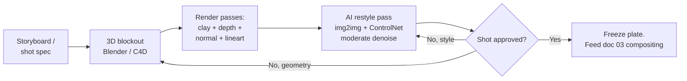

# 01 — Clay-Render Transfer (白膜迁移)

[中文版本](../zh/01-clay-render-transfer.md)

> **What this is:** lock a shot's geometry with an untextured 3D render — a clay
> render from a Blender/C4D blockout or previz — then let AI restyle it into the final
> look while geometry, camera path, and layout stay fixed. You spend the complexity
> budget on appearance only; structure is already paid for in 3D.

This is rung **T3** in the [technique ladder](00-decision-framework.md#3-the-technique-ladder).

---

## When to use it

Use clay-render transfer when the routing questions answer this way:

- **Q3 (exact composition/camera): YES.** You need a specific dolly, crane, or
  hand-held path, or a layout that must match a storyboard frame-for-frame. Camera
  paths are a 3D problem. Prompt them and you get drift.
- **Q2 (consistency): the environment must stay identical** across many shots or a
  long move. A 3D scene is deterministic — the same set renders the same way from any
  angle, forever.
- **Q4 (interaction): you plan to composite a subject into this environment later**
  (T4, [doc 03](03-multistep-video-generation.md)). A restyled clay render gives you a
  stable environment plate with known geometry — and you already have the depth pass
  for free.
- **Q1: any duration**, because you render the blockout frame sequence and process
  frame-by-frame. Length costs compute, not coherence.

Typical targets: a precise camera move through a stylized city, an architectural
flythrough with a specific art direction, a storyboard-locked action layout.

## When NOT to use it

- **No exact camera or layout requirement.** If "a forest at dusk, camera drifts
  forward" is good enough, T0/T1 wins on cost. Three to five seeds of a video model
  is minutes of work; a blockout is hours.
- **You already have footage.** If the geometry exists in real video, extract depth
  and restyle directly — that is T2 ([doc 02](02-depth-video.md)). Building a 3D
  replica of footage you could have depth-guided is paying the budget twice.
- **Organic chaos is the point.** Fire, crowds, water, foliage in wind — blockouts
  describe these badly, and the restyle pass will invent most of the frame anyway.
  That invention is T0 territory with a prompt, cheaper.
- **Nobody on the team can model.** A rough blockout takes a day to learn to build
  badly and a week to build well. If the shot airs once and "close enough" passes,
  that week is a loss (Q6).

## The pipeline

### 1. Build the blockout — fast

- Primitive-level detail is enough. Boxes for buildings, cylinders for columns, a
  low-poly proxy for a vehicle. The AI invents surface detail; the blockout only
  needs to carry **massing, perspective, and layout**.
- **Match the lens before anything else.** Set the camera focal length in Blender/C4D
  to the intended shot's lens (e.g. 24mm for a wide establishing move, 50mm+ for a
  compressed dolly). Perspective is baked into every downstream pass; if the lens is
  wrong, everything is wrong.
- Set the final frame aspect ratio and resolution now. The restyle pass resamples
  whatever you give it; resampling twice costs detail.
- Rough scale matters for depth: a doorway should be roughly door-sized, so the depth
  gradient reads correctly to the ControlNet model.
- Budget: a competent artist blocks a single set in 2–8 hours. If you are past two
  days on the blockout, see Failure modes.

### 2. Export the passes

From the same camera, same frame range, export:

- **Clay render** — the untextured beauty pass. Neutral gray material, one soft
  key light or flat ambient. This is the img2img input.
- **Depth** — z-depth pass, normalized per shot (not per frame — per-frame
  normalization causes depth pumping). Feeds ControlNet depth.
- **Normal** — surface orientation. Optional, but it stabilizes shading on flat
  surfaces where depth alone is ambiguous.
- **Lineart** — freestyle/edge render from the 3D package, or run a lineart
  preprocessor on the clay frames. Feeds a second ControlNet unit to pin silhouettes
  and hard edges.

For a still, one frame of each. For video, the full sequence of each, same naming,
same frame numbers.

### 3. The restyle pass

In ComfyUI, per frame (still or video):

1. `Load Image` (clay frame) → `VAE Encode` → `KSampler` (img2img) → `VAE Decode`.
2. `ControlNet Apply` with the depth map (weight ~0.8–1.0 as a starting point).
3. Second `ControlNet Apply` with lineart (weight ~0.5–0.7 as a starting point) to
   hold edges the depth map misses.
4. Prompt for style and materials only: "brutalist concrete city, overcast, wet
   asphalt, volumetric haze" — never for layout. The layout is the input image's job.
5. **Denoise sweet spot: roughly 0.45–0.65.** Below ~0.45 the output stays gray clay
   with a texture filter on it; above ~0.65 the model starts moving geometry —
   windows migrate, rooflines bend, perspective drifts. Tune inside that band per
   shot; these numbers are starting points, not guarantees, and they shift with
   model and ControlNet strength. As of 2026, check current docs for the model you
   use.

Approve one hero frame before batching. Get the style right on a single frame, then
freeze the prompt, seed strategy, and weights.

### 4. Per-frame for video: temporal consistency

A frame-by-frame img2img pass flickers by default. Mitigations, cheapest first:

- **Shared seed across the whole sequence.** Same seed, same prompt, same settings —
  only the input frame changes. This alone removes most high-frequency flicker.
- **Lock ControlNet weights and sampler settings for the run.** Any per-frame
  variation in guidance becomes visible pulsing.
- **Deflicker pass after generation** (a temporal-smoothing plugin in your editor, or
  a dedicated deflicker node/script). Treat it as polish, not as the fix.
- **Optical-flow check on the output.** Compute flow between consecutive restyled
  frames and compare it to flow between consecutive clay frames. Where restyled flow
  diverges sharply from clay flow, the model moved geometry on that frame — re-run
  those frames at lower denoise or with higher ControlNet weight instead of
  re-running the whole shot.
- If flicker still fails the shot, escalate to a video model that accepts structural
  guidance (depth/lineart per frame) instead of per-frame img2img. That trades the
  ComfyUI workbench for one sampling pass with native temporal attention — as of
  2026 several video models take per-frame control input; check current docs.

### 5. Hand off to compositing

The approved restyled sequence is your **environment plate**. Freeze it. It feeds
[03 — Multistep compositing](03-multistep-video-generation.md) as the background the
subject gets merged into — and because you built the set, you already own the depth
pass that T4 compositing needs for occlusion and mid-pipeline denoise. Never
regenerate the plate after a downstream step has been approved on top of it.

## Failure modes

- **Style bleeding into geometry at high denoise.**
  Symptom: windows crawl along a wall between frames; rooflines bend; the room is
  subtly larger in frame 80 than frame 1.
  Cause: denoise above the geometry-holding threshold (roughly >0.65 with typical
  ControlNet depth), or ControlNet weight too low to pin structure.
  Fix: drop denoise back into the 0.45–0.65 band, raise depth ControlNet weight
  toward 1.0, add the lineart unit. Re-run the affected frames, not the sequence.

- **Temporal flicker across frames.**
  Symptom: textures boil, lighting pulses, small features appear and vanish frame to
  frame while the layout stays put.
  Cause: per-frame sampling variance — different seeds, or settings that drift
  across the batch.
  Fix: shared seed for the whole shot, locked sampler/ControlNet settings, then a
  deflicker pass as polish. Verify with the optical-flow check; re-run only the
  offending frames.

- **Over-detailed blockouts wasting days.**
  Symptom: a week spent modeling window frames, roof tiles, and props before a single
  AI pass has run.
  Cause: treating the blockout as a final 3D deliverable instead of a geometry
  carrier. Every modeled detail the AI was going to invent anyway is budget spent
  twice.
  Fix: stop at massing + lens + scale. Test the restyle on a primitive-level
  blockout after the first two hours; only add geometry where the restyle
  demonstrably misreads the shape (e.g. the model turns a flat wall into a street).

- **Camera/lens mismatch between blockout and intended shot.**
  Symptom: the restyle looks right but the shot feels wrong — space too deep or too
  flat versus the storyboard; a character composited later never sits in the scene.
  Cause: blockout camera focal length or height doesn't match the intended lens;
  perspective is baked into every pass and cannot be fixed downstream.
  Fix: fix it in 3D, not in the prompt. Re-set the camera, re-render the passes.
  This is the one failure that legitimately sends you back to step 1.

- **Depth pumping on moving shots.**
  Symptom: the apparent depth range breathes over the course of a move; distant
  geometry jumps forward and back.
  Cause: depth exported with per-frame normalization, so frame N's far plane differs
  from frame N+1's.
  Fix: normalize the depth pass once across the whole frame range (fixed near/far
  values), then re-export.

## Cost notes

Rough multipliers versus a single T0 pass, for a 5-second shot:

- **Blockout:** 2–8 hours of artist time for a primitive-level set (one-time per
  set; reused across every shot on that set).
- **Restyle compute:** about 1.0–1.5× a single img2img pass per frame — two
  ControlNet units add modest cost over one plain KSampler run. For 120 frames that
  is 120–180 single-pass equivalents, plus re-runs for the frames the flow check
  flags (typically 5–15% of the sequence).
- **Deflicker + flow check:** minutes of compute, negligible against generation.
- **Net:** expect roughly 5–10× the compute of one video generation pass, plus the
  blockout hours. Worth it when Q3 demands an exact camera — a T0 attempt at a
  precise dolly typically burns more than 10 seeds without landing the path, and
  still doesn't hold the layout.

---

**Prev:** [00 — The Decision Framework](00-decision-framework.md) ·
**Next:** [02 — Depth-Guided Video](02-depth-video.md)
