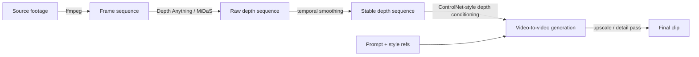
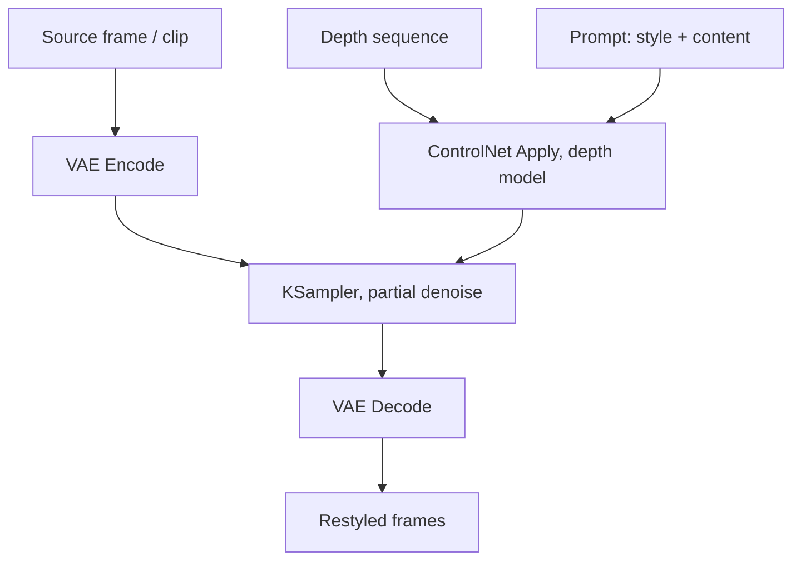

# 02 — Depth-Guided Video (深度视频)

Per-frame depth maps as the structural steering wheel: extract depth from source footage (or from a 3D render), and feed it into video-to-video generation so the geometry stays locked while the appearance changes. This is rung **T2**.

[中文版本](../zh/02-depth-video.md)

---

## What this is

A depth map is a per-pixel distance image: near is bright, far is dark (or the inverse — conventions vary, check your node). A depth estimator (Depth Anything, MiDaS) or a 3D renderer (Blender's Z pass, Mist pass) gives you one depth map per frame. Feed that sequence to a depth-conditioned video model — typically a ControlNet-style adapter on a video diffusion model — and the model restyles the footage without moving the walls.

The split of labor: **depth owns geometry, the prompt owns appearance.** That is one dimension of the complexity budget spent by a precomputed artifact instead of by sampling luck.

## When to use it

Route here when your Q1–Q6 answers look like this:

- **Q5 = restyle of existing footage.** This is the core case. Real drone footage → anime. A phone clip of your street → cyberpunk. The geometry is already correct in the source; you only want appearance to change. See the routing table in [00](00-decision-framework.md): "Turn real drone footage into anime → T2".
- **Q3 = composition must not drift.** The camera move and layout of the source are approved. Depth keeps the generation inside those walls even at high restyle strength.
- **Q2 = moderate.** Depth locks structure, not identity. A character's silhouette survives; their face details do not, unless you add more conditioning (see "Combining depth with pose/canny" below).
- **Q1 = short to medium clips.** Single-clip lengths your video model handles reliably. For longer, chain this under T5 ([04](04-long-take-continuous-shot.md)).
- **Q6 = you can afford roughly 1.5–3× single-pass cost.** You are paying for extraction plus a conditioned generation pass.

## When NOT to use it

- **You are generating from scratch, not restyling.** If there is no source footage whose geometry you trust, depth has nothing to steer. Route to T0/T1, or build a blockout and use T3 ([01](01-clay-render-transfer.md)) — a clay render gives you *exact* geometry, an estimated depth map only gives you a guess.
- **The change is small.** Color grade, light stylization, mild cleanup: a low-denoise video-to-video pass without any conditioning is cheaper and often sufficient. Spend 15 minutes there first (escalation discipline, rule 1).
- **The footage is mostly transparent or reflective surfaces.** Glass storefronts, water, mirrors, chrome. Depth estimators hallucinate on these and the guidance becomes noise. Fix the depth manually or pick a different route.
- **You need character identity locked.** Depth preserves a silhouette, not a face. If the character must stay identical, that is a T4 problem ([03](03-multistep-video-generation.md)) — generate the character separately and merge.

## The pipeline



### 1. Extract frames

Split the source into a frame sequence at the frame rate you will generate at:

```bash
ffmpeg -i source.mp4 -vf fps=24 frames/%05d.png
```

Use PNG, not JPEG — depth estimation is sensitive to compression artifacts in flat gradients. Keep the source resolution for now; you decide generation resolution in step 4.

### 2. Extract depth per frame

Run a depth estimator over the sequence. Two practical options:

- **Depth Anything** — the current default for monocular estimation; robust across indoor/outdoor footage. Inside ComfyUI it is available as a preprocessor node for ControlNet Apply, or standalone for batch extraction.
- **MiDaS** — the older workhorse; still fine, generally weaker on fine detail.
- **3D render depth** — if your source is a Blender/CG previz, skip estimation entirely: render the Z or Mist pass directly. It is exact, flicker-free, and already aligned. This is the best depth you can get.

As of 2026, depth model releases move fast — check current docs for the strongest estimator before batch-processing a long clip.

Batch-process the whole sequence, save as 16-bit PNG if your toolchain allows (8-bit bands visibly on large flat surfaces like walls and sky).

### 3. Stabilize the depth sequence

Monocular depth estimators process frames independently. Small per-frame estimation noise becomes visible flicker once it steers generation. Stabilize before you generate, cheapest first:

1. **Temporal smoothing** — a short-window weighted average across neighboring frames (e.g. 3–5 frames). Cheap, blurs fast motion slightly.
2. **Optical-flow-guided smoothing** — warp the previous frame's depth into the current frame using estimated optical flow, then blend. Preserves moving edges better than naive averaging.
3. **Deflicker pass** — apply a video deflicker filter to the depth sequence as if it were footage.
4. **EBSynth-style propagation** — hand-fix a few keyframe depth maps, propagate corrections across the sequence with patch-match propagation. Most manual work; use it for hero shots where a specific region (a face, a doorway) must be exact.

Judge the result by scrubbing the depth sequence as video. Flicker you can see in depth will become crawling edges in the output.

### 4. Generate with depth conditioning

In ComfyUI, the shape of the graph is:



Starting points — explicitly starting points, tune from here:

- **Denoise strength 0.55–0.75** for a full restyle; 0.35–0.5 for a light one. Lower keeps more source texture (and more source artifacts).
- **ControlNet depth strength 0.7–1.0** at the start of sampling; some graphs taper it over the sampling steps so the model can invent surface detail late.
- **Generate at the depth map's native aspect ratio.** Resolution mismatch is a real failure mode — see below.
- Match the ControlNet depth model to your base video model's family. A depth adapter trained for an image model is not automatically valid for a video model; as of 2026, check which adapter/model pairs are current.

### 5. Combining depth with pose/canny when characters are involved

Depth alone locks the set, not the actor. When people are in frame and their silhouette must survive the restyle:

- **Depth + OpenPose**: depth steers the environment, pose steers the body. Apply both ControlNet units at moderate strength (start ~0.7 each) rather than one at full strength — two strong conditions fight, two moderate ones cooperate.
- **Depth + canny/lineart**: when the character's *outfit and edges* matter more than their skeleton (e.g. a mascot costume, a product in hand). Canny preserves contours; depth preserves the room.
- Budget rule: every added condition is another constraint on the same sampling pass. Two is usually fine; three starts eroding prompt influence and raises the cherry-picking rate. If you need depth + pose + identity, that is the signal to split the shot and go T4.

### 6. Finish

Reassemble frames (`ffmpeg -framerate 24 -i out/%05d.png ...`), then run an upscale + detail pass on the approved result. Freeze the approved clip before any further pass — never re-extract depth from an already-restyled output to feed another restyle; artifacts compound.

### Bonus: depth as a grading tool

The same depth sequence is useful *after* generation, in compositing or grading:

- **Depth of field** — use the depth map to drive a per-pixel blur. Cheaper and more controllable than asking the model to "add bokeh", and it survives cuts because it derives from geometry, not from sampling.
- **Atmospheric fog / aerial perspective** — lerp toward a fog color proportional to depth. Instantly adds scale to landscapes and city shots.
- **Relighting masks** — depth-thresholded mattes (near subject vs. far background) let you grade subject and environment separately without rotoscoping.

These passes are deterministic: zero sampling, zero seeds. When a look can be achieved in grading instead of generation, grade.

## Failure modes

**Flickering depth on fine structures (hair, foliage, fences, wires)**
→ Cause: per-frame estimation noise is largest on thin, high-frequency structures; each frame disagrees about where the hair edge is.
→ Fix: stabilize the depth sequence (step 3) before generation; if one region flickers, mask that region out of the depth guidance or patch it with EBSynth-style propagation from a hand-fixed keyframe. As a last resort, reduce depth conditioning strength on those frames and let the prompt carry the region.

**Transparent/reflective surfaces break the depth estimator**
→ Cause: monocular estimators infer depth from texture and shading cues; glass, water, mirrors and chrome return the depth of the *reflected* scene, not the surface.
→ Fix: hand-paint or patch the depth for those regions (a flat gray at the correct plane is often enough), or rotoscope a corrected depth plate. If the shot is *dominated* by such surfaces, leave T2 — the guidance is worse than no guidance.

**Depth-vs-prompt conflict (depth says wall, prompt says window)**
→ Cause: you are asking the pass to violate its own conditioning. The sampler compromises: a window-shaped smear on a wall, or geometry that drifts between frames.
→ Fix: change one side, not both. Either edit the depth map (paint the window opening into depth — depth is just an image, you can Photoshop it) or change the prompt to agree with the geometry. Do not raise prompt weight and depth weight simultaneously; that maximizes the fight.

**Resolution mismatch between the depth pass and the generation pass**
→ Cause: depth extracted at source resolution (e.g. 1080p) but generation runs at the video model's native resolution (e.g. 768×512); the resized depth map shifts and softens every edge, and fine structures misalign.
→ Fix: extract or downscale depth to the exact generation resolution, and generate at the source's aspect ratio. Verify alignment by overlaying one depth frame on its source frame at generation size before batching.

**Restyled output crawls or "boils" on flat surfaces**
→ Cause: 8-bit depth banding on large gradients (sky, walls) plus high denoise strength — the sampler invents new texture every frame.
→ Fix: extract depth at 16-bit if possible, add slight temporal smoothing, and lower denoise into the 0.5–0.6 range. A light deflicker pass on the output helps, but fixing the depth is cheaper than fixing the video.

**Character silhouette survives but identity drifts**
→ Cause: expected, not a bug — depth conditions geometry, not appearance.
→ Fix: add a pose or canny condition (section 5), or accept it and keep the character's face out of the restyle via a mask, compositing the original face back. If identity is a hard requirement across shots, escalate to T4.

## Cost notes

Rough multipliers vs. a single-pass text-to-video generation of the same final clip:

| Step | Cost |
|---|---|
| Frame extraction (ffmpeg) | Negligible (seconds, CPU) |
| Depth extraction | ~0.1–0.3× one generation pass for a short clip; GPU or decent CPU |
| Temporal smoothing / deflicker | Negligible to ~0.1× (EBSynth-style propagation adds manual hours, not compute) |
| Depth-conditioned generation | ~1–2× a single pass (conditioning overhead + the rerolls you still need) |
| **Total** | **~1.5–3× single-pass**, plus pipeline setup time on the first clip |

The multiplier buys you a hard guarantee — geometry does not drift — that no number of T0 rerolls reliably delivers. Per escalation discipline: if three to five unconditioned video-to-video seeds already hold your layout, you did not need this rung.

---

**Previous:** [01 — Clay-Render Transfer (白膜迁移)](01-clay-render-transfer.md) · **Next:** [03 — Multistep Video Generation](03-multistep-video-generation.md)
