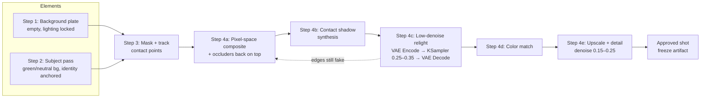

# 03 — Multistep Video Generation: Split the Shot, Merge the Parts

> **What this is:** generate the background, the subject, and the interaction as
> separate artifacts, then merge them with surgical ComfyUI passes in between.
> This is the core move of the playbook: spend the complexity budget one dimension
> at a time instead of asking one sampling pass to satisfy six constraints.

[中文版本](../zh/03-multistep-video-generation.md)

Ladder rung: **T4**. Sits between [T3 clay-render transfer](01-clay-render-transfer.md)
(which locks geometry for the environment) and [T5 long-take chaining](04-long-take-continuous-shot.md)
(which stretches any of this to minutes).

---

## When to use it

Route here when your Q1–Q6 answers look like this:

- **Q2 — consistency:** the subject must stay identical across shots, so it must be
  its own artifact, not something re-rolled per shot.
- **Q4 — interaction:** the subject touches, occludes, or is occluded by the
  environment. Contact is exactly what single-pass models handle worst and what
  naive compositing fakes worst.
- **Q1 — duration:** the shot fits inside one reliable clip length per element
  (roughly 5–10 s as of 2026, check current model docs). Longer than that, run T4
  per segment and chain with T5.
- **Q6 — budget:** you can afford 3–8× the compute of a single pass for this shot,
  and the shot matters enough to justify it.

The canonical case from doc 00's routing table: a character walks through a
generated forest and touches a tree. Three constraints (character identity,
environment, physical contact) that no single pass carries reliably.

## When NOT to use it

- **No interaction, single subject, loose consistency** → stay at T0/T1. A walking
  shot where the character never touches anything is usually a keyframe-anchored
  image-to-video problem. Three to five seeds first; escalate only on a named
  failure (doc 00, section 6).
- **You are restyling footage that already exists** → [T2](02-depth-video.md).
  The geometry and interaction are already real; don't regenerate them.
- **The camera move is the hard part** → [T3](01-clay-render-transfer.md). A dolly
  through a city is a previz problem, not a compositing problem. (Often you will
  use T3 for the plate and T4 for the merge — they compose.)
- **Q6 says no** → if the shot airs once and 4× compute buys a 10% quality gain,
  take the single pass and move on.

## The pipeline

### Step 0 — Plan for separability at storyboard time

Multistep is won or lost before generation starts. For each shot, decide:

- **Which pixels belong to which element.** Foreground subject, background plate,
  mid-ground occluders (branches, door frames, crowd). Anything that passes in
  front of the subject must be its own layer or part of the plate with a clean mask.
- **Where the contact happens.** Mark every frame where subject and environment
  touch: footfalls, a hand on a tree, sitting on a bench. Each contact point needs
  a shadow plan (below) and enough camera stability that you can track the contact
  area by hand if needed.
- **Where the camera is forgiving.** Slow pans and static frames composite well.
  Fast handheld with motion blur composites badly — motion blur must be rendered
  *after* the merge, not baked into one element. If the storyboard demands heavy
  handheld, budget extra merge passes or reroute.

A storyboard panel that cannot be decomposed into layers ("character is behind a
waterfall, half-dissolved in spray") is a warning: either simplify the shot or
accept that the merge step will be the most expensive one.

### Step 1 — Generate the background plate

Generate the environment **first**, empty of the hero subject.

- Prompt for the environment and the *lighting*, and for a plausible empty space
  where the subject will go ("a forest path, soft overcast light, dappled shadows
  on the ground"). Do not prompt "no people" obsessively — prompt the scene you
  want, minus the subject.
- Lock the camera. If the plate moves, it must move on a simple, repeatable path —
  or come from a T3 clay blockout where the camera is exact.
- Freeze the plate. Once approved, it is a fixed input. You do not regenerate the
  forest because the character pass had a bad seed (doc 00, section 6, rule 4).

### Step 2 — Generate the subject separately

Generate the character/subject against a green screen, a flat neutral background,
or with an alpha channel if your model/tool emits one.

- Identity comes from an approved keyframe or reference image (T1 discipline):
  same face, same costume, same proportions as every other shot.
- Match the plate's **lighting direction** in the prompt ("lit from camera-left,
  cool ambient") and, better, in the reference: a character lit against the light
  direction of the plate cannot be fixed cheaply downstream.
- Generate the motion the storyboard needs — walk cycle, reach, touch — at a
  framing that leaves mask margins. Tight crops make masks brittle.
- Green/neutral background beats alpha-in-model for most pipelines as of 2026:
  a clean chroma or difference matte is a solved problem; generated alpha is not.
  Check current model docs before relying on native alpha output.

### Step 3 — Extract the mask and track the contact

- Pull the subject mask per frame (chroma key for green screen, or a segmentation
  pass). Feather edges 1–2 px; hard edges read as stickers.
- Identify occluders from the plate that pass *in front* of the subject (a branch,
  a tree trunk). Mask those too, and composite them back over the subject later.
- Mark contact frames and contact areas: where the feet meet the ground, where
  the hand meets the bark.

### Step 4 — Merge, with mid-pipeline passes

The merge is not one paste. It is a short chain:

1. **Composite in pixel space.** Place the masked subject into the plate at the
   storyboarded position and scale. Composite occluder masks back on top.
2. **Shadow synthesis.** This is the make-or-break step (see below). Paint or
   generate contact shadows at every contact point before any AI pass, so the
   harmonization pass sees a plausible scene instead of inventing shadows
   inconsistently per frame.
3. **Low-strength denoise/relight pass (ComfyUI).** VAE Encode the composite
   frame sequence, run KSampler at low denoise — **start at 0.25–0.35** (starting
   point, not a law) — with the same model family that generated the plate, then
   VAE Decode. This re-renders the pasted edges into the plate's lighting and
   grain. Above ~0.45 the pass starts redesigning your frozen artifacts; below
   ~0.2 it does nothing.
4. **Color match.** Match black/white points and white balance of subject to
   plate. Often a simple curves/levels grade does more than another AI pass.
5. **Upscale + detail.** Run an upscale-model pass on the *merged, approved*
   frame, with a light denoise (start ~0.15–0.25) to regenerate texture detail.
   Upscale last: it is the most expensive pass per frame and the easiest to redo.

### Pixel space vs latent space

Two places to merge; choose deliberately:

- **Pixel space first, almost always.** Paste masked RGB frames, then harmonize
  with a low-denoise pass. It is debuggable: you can see exactly which layer is
  wrong, adjust the mask, and re-run one pass.
- **Latent space** (VAE-encode both elements, combine latents with a mask, then
  sample) buys smoother blending at soft boundaries — hair against sky, fog,
  volumetric light — where a hard pixel mask never looks right. The cost: the
  blend region is resampled, so anything inside it is no longer frozen. Keep
  latent blends away from faces, logos, and anything Q2 says must not change.

Rule of thumb: pixel merge for hard edges and identities; latent merge for
atmospherics and soft boundaries; pixel merge even there if the shot has a face
near the blend.

### QA gates between steps

Each step ends with a gate, and a passed gate means the artifact is **frozen**
(doc 00, section 6, rule 4):

| Gate | Check before freezing |
|---|---|
| Plate approved | Lighting direction named; empty space for subject exists; camera path documented; no flicker across frames. |
| Subject approved | Identity matches reference (face, costume); lighting direction matches the plate's; motion covers the storyboard beat; mask extracts cleanly. |
| Composite approved | Contact shadows present at every marked contact point; occluders in front; no double edges or halo. |
| Harmonize approved | Denoise did not redesign frozen content (diff against pre-pass frame; check face and costume); grain and lighting now continuous. |
| Final approved | Upscale introduced no new artifacts; contact points still read; shot plays at speed without flicker. |

A failed gate routes *back one step*, not forward with patches. If harmonization
keeps failing, the usual cause is upstream: lighting direction mismatch at step 2
or a missing shadow at step 4b.

## Failure modes

- **Symptom:** subject looks like a sticker pasted on the scene.
  **Cause:** pasted edge plus no harmonization — the pixel merge was the final step.
  **Fix:** add the low-denoise relight pass (start 0.25–0.35) and match grain;
  check that the subject was generated at roughly the plate's sharpness and noise level.

- **Symptom:** the character floats; the ground does not believe the feet.
  **Cause:** no contact shadows, or shadows at the wrong angle/density for the plate.
  **Fix:** go back to step 4b. Paint/generate a soft contact shadow under each
  footfall, direction consistent with the plate's named lighting direction. If the
  plate has dappled light, the shadow must be dappled too — a uniform grey blob is
  worse than none.

- **Symptom:** face or costume changes after the relight pass.
  **Cause:** denoise strength too high; the pass is resampling your frozen identity.
  **Fix:** lower denoise toward 0.2, mask the face out of the resampled region
  (harmonize the body/edges, keep identity pixels), or move that region's merge
  to pure pixel space.

- **Symptom:** flickering edges or crawling outline on the merged shot.
  **Cause:** per-frame masks or per-frame denoise seeds drift; each frame is
  harmonized slightly differently.
  **Fix:** fix the seed for the harmonization pass, temporal-check masks
  (a mask should not change area by more than a few percent frame to frame), and
  re-run. If the source subject pass itself flickers, that is a step-2 gate failure —
  regenerate the subject, not the merge.

- **Symptom:** colors shift between the subject pass and the merged result.
  **Cause:** the low-denoise pass re-graded the subject toward the plate, or the
  two elements were generated under different white balances.
  **Fix:** color-match *before* the AI pass (step 4d order matters when the shift
  is large), and keep denoise low. Grade the final merged frame, never the frozen
  subject alone.

- **Symptom:** the touch moment (hand on tree) looks wrong — hand sinks into bark
  or hovers.
  **Cause:** the two elements were generated without a shared contact geometry;
  the hand's trajectory and the tree's position were never reconciled.
  **Fix:** this is a storyboard failure, not a merge failure. Anchor the contact:
  generate the plate with the tree at a known screen position, keyframe the
  subject's reach to that position, and if the contact must be exact, render that
  beat from a T3 blockout instead of hoping two independent passes meet.

## Cost notes

Against a single-pass generation of the same shot:

- **Compute:** roughly 3–8× — one plate pass, one subject pass (often 2–4 seeds
  each at gate time), a harmonization pass per frame, and an upscale pass. The
  harmonize and upscale passes run on every frame, so cost scales with shot length.
- **Wall-clock:** expect hours, not minutes, for a 5–10 s shot with QA gates
  done honestly. The gates are where time goes; skipping them converts saved
  minutes into redone days.
- **Failure economics:** each gated step succeeds at high rate because it carries
  one or two constraints. The pipeline wins when a single pass would need 10+
  seeds to land identity + environment + contact at once — usually the moment Q4
  is a real requirement.

## Worked example: character walks through a forest and touches a tree

Target shot: 6 s, slow lateral dolly, overcast forest. A woman in a red coat
walks camera-left to camera-right along a path and, at 4 s, reaches out and
touches a birch trunk in the mid-ground.

- **Storyboard (step 0).** Layers: plate (forest, path, birch), subject (woman),
  one occluder (a foreground branch crossing frame right at 5–6 s). Contact
  points: feet on path every frame; right hand on bark at 4–5 s. Camera: 0.5 m/s
  lateral dolly — slow enough to composite, so proceed at T4.
- **Plate (step 1).** Text-to-video: "overcast birch forest, dirt path curving
  right, soft diffused light from camera-left, empty path, slow lateral dolly."
  Seed 2 passes the gate: lighting direction named (camera-left, soft), path is
  empty, dolly is smooth. **Freeze.**
- **Subject (step 2).** Reference: approved character sheet, red coat, face
  locked. Generate against green: "woman in red coat walking left to right,
  overcast soft light from camera-left, full body in frame, reaches out and
  touches at the end." Seed 4 passes: identity matches, light direction matches,
  reach happens. **Freeze.**
- **Mask + track (step 3).** Chroma key per frame, feather 1 px. The hand is
  small in frame — flag it: the touch beat gets manual mask cleanup on the
  20 frames around contact. Foreground branch masked from the plate.
- **Composite (step 4a).** Woman placed on the path, scale set so her stride
  matches ground speed; branch composited over her at 5–6 s.
- **Shadows (step 4b).** Soft contact shadow under each footfall, direction
  camera-left-consistent; at the touch, a subtle darkening where fingers meet
  bark. No dappling in the plate (overcast), so shadows stay soft and uniform.
- **Harmonize (step 4c).** VAE Encode → KSampler at denoise 0.3, fixed seed →
  VAE Decode. Diff against pre-pass: face and coat unchanged, edges now sit in
  the plate's grain. Gate passes.
- **Color + upscale (steps 4d–4e).** Black point of the subject lifted 3% to
  match the plate's haze. Upscale pass at denoise 0.2. Final gate: play at
  speed, watch the touch frames twice. **Freeze; ship.**
- **If it must run 60 s instead of 6:** same pipeline per segment, chained with
  [T5](04-long-take-continuous-shot.md) — the frozen plate segments become the
  continuity anchors.

---

**Previous:** [02 — Depth/Structure-Guided Video](02-depth-video.md) ·
**Next:** [04 — Long-Take Chaining (一镜到底)](04-long-take-continuous-shot.md)
