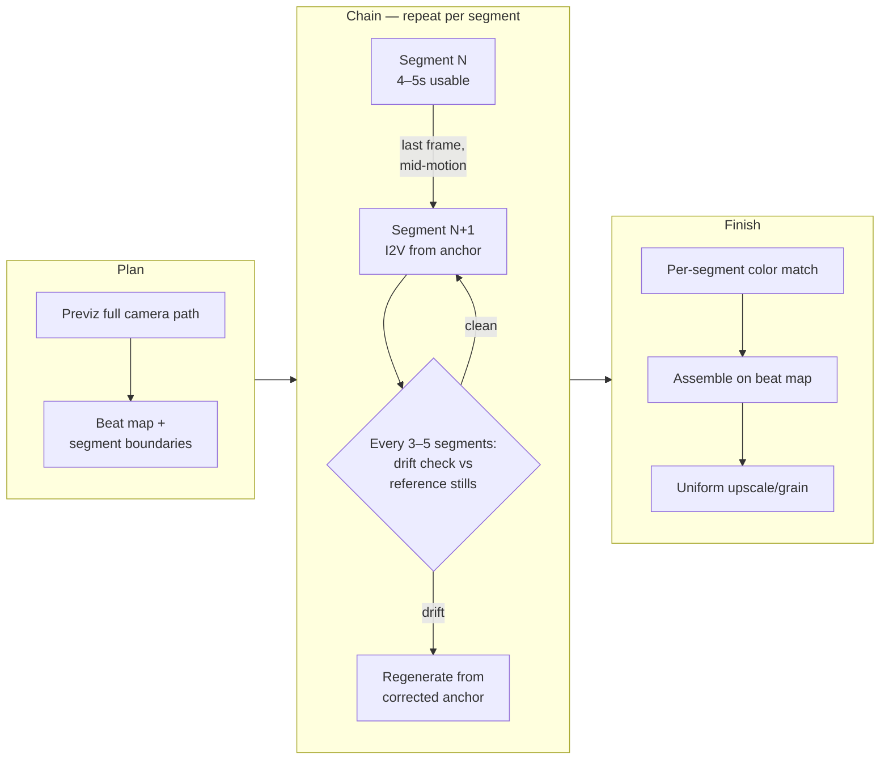

# 04 — Long-Take Chaining: Minutes-Long Continuous Shots (一镜到底)

> **What this is:** building a single continuous shot that runs far longer than any
> model's reliable clip length — a 2-minute walkthrough, a 10-minute one-take music
> video — by generating overlapping segments and chaining them with continuity
> anchors, so the cut points are invisible.

[中文版本](../zh/04-long-take-continuous-shot.md)

---

## When to use it

Use T5 when your routing answers look like this:

- **Q1 (duration):** the final shot is minutes long, and no available model holds
  coherence for that long in one pass. As of 2026, most models are reliable in the
  4–10s range and get dicey past that — check current docs, this number moves fast.
- **Q2 (identity):** the same subject must survive the whole duration. A chain with
  anchors beats one long generation precisely because you can re-assert identity at
  every segment boundary.
- **Q3 (camera):** the shot is one unbroken camera move, so there is nowhere to hide
  a cut. That is the definition of the problem — chaining exists to fake "no cut."
- **Q6 (budget):** you can afford 5–20× single-pass cost per final second. If you
  can't, shoot coverage and cut instead — editing is still cheaper than chaining.

Typical targets: one-take music videos, continuous walkthroughs of a generated
space, "oner" action shots, long product orbits.

## When NOT to use it

- **The shot can be cut into coverage.** A scene told in six normal shots is a T0–T4
  problem. Chaining is for shots that *must not* cut. If the director accepts cuts,
  take the cuts — you drop from T5 to T1 per shot and save an order of magnitude.
- **The model can already do the duration.** If your target is 20s and your model is
  reliable at 20s, that is T0/T1, not a chain. Chaining 3 segments to reach a length
  a single pass handles is over-escalation.
- **You have real footage of anything in the shot.** If the camera move can be shot
  or previz'd for real, T2 (video-to-video restyle) or T3 (clay-render transfer) on
  one continuous plate is far more stable than chaining generated segments.
- **Nothing anchors the subject.** If you have no character sheet, no LoRA, no
  reference stills — fix that first (T1 discipline) before chaining, or every segment
  boundary becomes a coin flip on identity.

## The pipeline

Assume a concrete target: a 10-minute (600s) one-take music video, one performer,
continuous camera. All numbers below are **starting points**, not recipes.

1. **Plan the camera path before generating anything.** Storyboard or previz the
   whole 600s as one path — Blender camera, animatic, or even a phone video walking
   the route. Mark where the camera is at every 5s. The rule for every segment
   boundary: **motion must never dead-end at a seam.** The camera (or subject) must
   be mid-move with visible velocity when a segment ends, so the next segment
   inherits a direction, not a static frame. Static-to-static seams read as cuts.
2. **Choose segment length from the model, not from the music.** Set segment length
   slightly *under* the model's reliable clip length. If the model is solid at 5s,
   generate 4–4.5s usable and overlap segments by 0.5–2s. For 600s at 5s segments
   with 1s overlap, that is ~150 segments. Write that number down; it is your
   schedule.
3. **Map segments to the audio.** For music videos, align segment boundaries to
   beats or bars, and put the *hidden* seams (step 7) on percussion hits, downbeats,
   or lyric transitions. Beat-mapped boundaries do two jobs: the cut rhythm feels
   intentional, and transient audio distracts the eye exactly where the seam is.
   Keep a beat map (BPM → frame numbers) as a production artifact next to the
   storyboard.
4. **Lock the identity kit.** Before segment 1: approved character sheet or
   turnaround, a fixed LoRA (if you use one), a fixed seed policy (same seed family
   per setup, changed only when a segment demonstrably fails), and 3–5 reference
   stills of the subject in the target style. Freeze all of it. This is the
   escalation-discipline rule from doc 00 applied to a chain: approved artifacts are
   inputs, never regenerated downstream.
5. **Chain segment N → N+1 with an anchor.** In order of preference:
   - **Last-frame → first-frame:** extract the last frame of approved segment N and
     use it as the image-to-video start frame of segment N+1. Simple, works
     everywhere. The overlap (step 2) gives you a few candidate last frames — pick
     the sharpest one mid-motion.
   - **First+last frame bridging:** if the tool accepts an end frame, generate N+1
     anchored at both ends (start = N's last frame, end = a planned keyframe from
     the previz). Strongest control, fewer degrees of freedom for the model.
   - **Latent/context carry-over:** in ComfyUI, context-window samplers (e.g.
     AnimateDiff-style context options) or video-extend nodes can carry motion
     latent context across the boundary instead of just one RGB frame. Better motion
     continuity, more VRAM, more graph complexity — as of 2026 the exact node names
     and behaviors shift monthly, check current docs.
6. **Re-anchor against drift every few segments.** Every 3–5 segments, compare the
   current frames against the frozen reference stills. If the face, costume, or set
   has drifted, do not keep chaining from the drifted frame — regenerate the next
   segment from a corrected anchor (reference still composited with the current
   last-frame pose, or an IPAdapter-guided pass at moderate weight). Drift compounds;
   catching it every 20s of footage beats reshooting 60 segments at the end.
7. **Hide the seams.** Even good anchors leave micro-pops. Place, in order of
   preference:
   - **Whip pan:** schedule a fast camera swing across the boundary; 3–6 frames of
     motion blur hide everything. This is why step 1 demands velocity at seams.
   - **Occlusion wipe:** pass the subject or a foreground object across the lens at
     the boundary.
   - **Motion-blur frames:** if the generated motion is too clean, add 2–4 frames of
     directional blur in post at the seam.
   - **Match cut:** as a last resort, cut on a strong shape match (door frame to
     door frame). It is a cut — but a planned one reads as style, not failure.
8. **Conform color per segment.** Perceptually match every segment to its neighbors
   before the final assemble: at minimum, match the seam-frame histograms; better, a
   per-segment grade in DaVinci Resolve or a LUT chain. Do this *before* upscaling,
   on the approved segments.
9. **Assemble, then finish.** Concatenate on the beat map, crossfade only inside the
   overlap windows, then run the finishing passes (upscale, grain, sharpen) on the
   *assembled* timeline so the finishing is uniform across seams.

## Failure modes

- **Identity drift accumulates across segments.**
  Symptom: the performer at minute 8 is recognizably not the performer from minute 1 —
  face proportions, hair, costume details wander.
  Cause: each last-frame anchor inherits the previous segment's small errors, and
  errors compound multiplicatively, never average out.
  Fix: the step 6 re-anchor loop. Compare against frozen stills every 3–5 segments;
  regenerate from a corrected anchor instead of chaining from a drifted frame. If
  drift appears within 2 segments, your identity kit (step 4) is too weak — stop and
  strengthen the LoRA/references before burning more segments.

- **Seam pops at segment boundaries.**
  Symptom: a visible jump — subject teleports a few pixels, background relights,
  texture flickers — at the chain points.
  Cause: anchoring on a static or motion-blurred last frame, or chaining with zero
  overlap so there is no candidate frame to choose.
  Fix: anchor on a sharp mid-motion frame, keep 0.5–2s overlap and pick the best
  boundary frame per seam, and route the seam through a hider (whip pan, occlusion,
  blur frames per step 7). A seam you cannot fix is a seam you should have planned a
  wipe over.

- **Lighting and color discontinuity.**
  Symptom: exposure or white balance steps at boundaries; the room's key light
  swings direction between segments.
  Cause: each segment samples its own lighting from the prompt; nothing propagates
  illumination state across the chain.
  Fix: carry explicit lighting language through every prompt (same time of day, same
  key direction), anchor first frames which already carry the previous segment's
  light, and conform color per segment (step 8) before assembly. Budget the grade —
  150 segments is 150 small grades.

- **Pacing dead spots.**
  Symptom: stretches where nothing happens — the camera drifts through empty space
  because a segment had to exist to reach the next planned beat.
  Cause: segment count was derived from duration (600s ÷ 5s = 120) instead of from
  content; padding segments got generated because the grid said so.
  Fix: the beat map owns the segment boundaries, not the clock. If a 5s slot has no
  planned action, change the camera (reframe, speed ramp, reveal) or cut the slot
  and re-time — never fill duration with unplanned generation. Dead air in a one-take
  is more visible than in coverage.

- **The chain breaks mid-production and upstream work is lost.**
  Symptom: at segment 80 you discover segment 30 had a wardrobe error; everything
  anchored on it is suspect.
  Cause: approving segments by eyeballing only the current one, not against the
  frozen kit.
  Fix: strict approval gates — a segment is frozen only after passing identity,
  lighting, and seam checks against the references. Never regenerate a frozen
  segment to fix a downstream problem; fix downstream instead.

## Cost notes

Against a hypothetical single-pass generation of the same final second:

- **Raw generation:** ~1.2–1.5× per second just from overlap (a 1s overlap on 5s
  segments means 20–25% of generated frames are discarded), before retries.
- **Retries:** each segment needs approval for identity *and* both seams, so expect
  2–4 seeds per accepted segment. ~150 segments × 2–4 seeds for a 10-minute piece.
- **Drift correction:** plan 10–20% of segments to be regenerated from corrected
  anchors.
- **Post:** per-segment color conform plus seam work — for a 150-segment piece this
  is days of editorial, not hours.
- **Realistic total:** **5–20× the compute of one pass per final second**, plus
  several days of human assembly for a 10-minute target. Q6 is not rhetorical at
  T5. If the piece will be watched once, reconsider whether it must be a one-take.

---

**Previous:** [03 — Multistep Compositing](03-multistep-video-generation.md)
**Next:** [05 — ComfyUI Integration Patterns](05-comfyui-integration.md)
