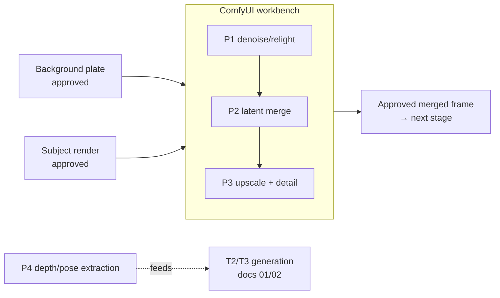

# 05 — ComfyUI Integration Patterns: The Workbench Between Steps

[中文版本](../zh/05-comfyui-integration.md)

ComfyUI's job in this playbook is surgical, not generative. It is where approved
artifacts go to be **blended, merged, upscaled, or measured** — not where shots are
born. This doc is four recipes (P1–P4) plus the batch/export plumbing to run them on
real footage.

---

## When to use it

Reach for a ComfyUI pass when you already hold two or more artifacts that are each
approved on their own, and the gap between them is a **pixel-level problem**, not a
concept problem:

- **Q4 answered "yes"** — the subject touches the environment, and a naive paste shows
  a cut-out edge, missing contact shadow, or mismatched light. → P1
- You generated background and subject **separately on purpose** (T4), and both are
  frozen. → P1 or P2
- Your approved keyframe/plate is 1024px and the deliverable is 4K. → P3
- You are entering T2/T3 and need depth or pose maps as structural guidance. → P4

Typical placement in a chain (see [03](03-multistep-video-generation.md)):

## When NOT to use it

- **Nothing is approved yet.** ComfyUI passes polish; they do not rescue. If the plate
  itself is wrong, regenerate it at T0/T1 — a relight pass will faithfully blend a bad
  plate into a bad composite.
- **The fix is one slider in your editor.** Color-matching a pasted subject with
  curves is cheaper than a KSampler pass when there is no light-wrap or texture
  interaction to fake. Try the dumb fix first.
- **You are tempted to generate from scratch here.** That collapses the complexity
  budget back into one pass — the exact failure this repo exists to prevent. Use the
  external generator for generation; use ComfyUI for the seams.
- **The shot is a single unedited clip with no compositing.** If T0 passed, you are
  done. Do not add a workbench pass because the graph looks fun.

## The pipeline

All four recipes share the same discipline: **inputs are frozen artifacts** (doc 00,
rule 4 — freeze approved artifacts), outputs are inspected before they are allowed
downstream. Parameter values below are **starting points**, not gospel; sampler and
preprocessor behavior is version-sensitive, so as of 2026, check current docs for your
ComfyUI build and node packs.

### P1 — Mid-pipeline denoise/relight: blending a pasted subject into a plate

**Goal:** take a hard composite (subject pasted onto background plate) and let the
diffusion model re-integrate edges, light wrap, and contact shadow — while changing
nothing else.

1. Build the naive composite upstream (editor, Photoshop, or an
   `ImageCompositeMasked` node). Freeze it.
2. In ComfyUI:
   - `Load Image` (the composite) → open in **MaskEditor**, paint a mask over the
     subject plus a margin.
   - `FeatherMask` (grow/feather 8–16 px starting point) so the model owns the
     boundary, not you.
   - `VAE Encode` → `Set Latent Noise Mask` (connect the feathered mask).
   - `KSampler` with **denoise 0.2–0.4 starting point**, low enough that only the
     masked region and its light interaction move. Prompt: describe the *lighting and
     material interaction* ("soft rim light from the window on the subject's left"),
     not the content.
   - `VAE Decode` → optionally `ImageCompositeMasked` against the original to restore
     any background pixels the VAE drifted.
   - `Save Image`.
3. Inspect before approving: edge seams at mask boundary at 200% zoom; contact shadow
   present and plausible; color temperature of subject vs. plate; face and fine detail
   unchanged from the frozen subject render.

### P2 — Latent-space merge of separately generated elements

**Goal:** merge two approved elements *before* decode, so the model resolves the
overlap in latent space instead of you fighting it in pixel space.

1. `Load Image` × 2 (frozen background, frozen subject layer) → `VAE Encode` each.
2. Build the mask on the image side (`ImageToMask`, or paint via MaskEditor and
   `MaskToImage` as needed), `FeatherMask`, then `LatentCompositeMasked` to place the
   subject latent into the background latent.
3. Light re-denoise to knit the seam: `KSampler` at **denoise 0.15–0.3 starting
   point**, again with `Set Latent Noise Mask` limited to the overlap band.
4. `VAE Decode` → `Save Image`.
5. Inspect: no ghosting or smear in the overlap band; perspective/scale consistency
   between elements; light direction agreement; background outside the mask pixel-
   identical to the frozen plate (composite it back if not).

P2 beats P1 when the subject's edges need the model to *invent* integration pixels
(fog, hair against bright background, motion blur). P1 beats P2 when the subject is
already final and you only need light harmonization — P2 re-encodes the subject and
costs you a little detail every time.

### P3 — Upscale + detail pass on approved frames

**Goal:** raise resolution and add micro-texture **without changing content**. The
frame is already approved; this pass is not allowed to have opinions.

1. `Load Image` (approved frame).
2. `Upscale Model Loader` + `Upscale Image (using Model)` — a content-preserving
   upscale model, 2× starting point. This pass alone changes almost nothing
   semantically; it is the safe 80%.
3. Optional detail pass: `VAE Encode` the upscaled image → `KSampler` at **denoise
   0.1–0.25 starting point** → `VAE Decode`. This is where texture comes from — and
   where content drift comes from if you get greedy.
4. For frames beyond VRAM: use a tiled workflow (tiled VAE decode / tiled upscale
   nodes from community packs). Tile sizes and node names vary by pack — as of 2026,
   check current docs.
5. `Save Image` at final resolution.
6. Inspect: toggle before/after at 100% — composition, faces, hands, text, and logos
   must be identical; added texture only in surfaces that should have it (fabric,
   foliage, skin); no over-sharpened halos on hard edges.

### P4 — Depth/pose extraction feeding docs 01/02

**Goal:** turn reference footage or approved frames into structural guidance maps for
T2 (depth-guided video) and T3 (clay-render transfer). Extraction only — no sampling.

1. `Load Image` (reference frame).
2. Preprocessor nodes — the standard route is the `comfyui_controlnet_aux` pack:
   - **Depth Anything** for per-frame depth maps,
   - **OpenPose / DWPose** preprocessors for pose skeletons.
3. `Save Image` the maps (PNG sequence for video work).
4. Downstream, in the generation graph of doc 01/02: `Load ControlNet Model` →
   `ControlNet Apply` between the depth/pose map and the `KSampler`, with
   **ControlNet strength 0.7–1.0 starting point** for hard geometry locks, lower when
   you want the model to breathe.
5. Inspect: depth map near/far ordering is correct (spot-check occlusions); no holes
   inside the subject silhouette; pose joints sit on actual articulation points;
   across a sequence, maps do not flicker frame-to-frame (if they do, the flicker will
   be amplified downstream — fix it here).

### Batch-processing frame sequences

Video means hundreds of frames. The reliable pattern:

1. Dump frames upstream: `ffmpeg -i clip.mp4 frames/%05d.png`.
2. Place them in ComfyUI's `input/` directory.
3. Queue the same graph once per frame, swapping the `Load Image` filename — via the
   HTTP API (`POST /prompt` with the graph in API JSON format, one call per frame) or a
   batch-loader node from a community pack. The API route is the boring, scriptable
   one; prefer it.
4. `Save Image` writes numbered outputs to `output/`.
5. Reassemble: `ffmpeg -framerate 24 -i output/%05d.png -c:v libx264 -crf 18 out.mp4`.

Rules: fix the seed for the whole sequence (per-frame seed variance is a flicker
generator), keep denoise low (drift compounds across frames), and inspect every Nth
frame plus the first/last — batch failures are systematic, so sampling the sequence
catches them.

### Exporting workflows into `workflows/`

A graph that only lives on your machine is not part of the pipeline. To commit one:

1. In ComfyUI, use **Save** (workflow JSON, not just API format) so the graph loads
   back into the UI.
2. Export both formats if the graph will be driven by scripts: the API-format JSON for
   `POST /prompt`, the workflow JSON for humans.
3. Drop the file in [`workflows/`](../../workflows/) with a name that says which recipe
   it implements, e.g. `p1-denoise-relight.json`.
4. Add an accompanying note (a short `.md` next to it) stating: which pattern (P1–P4)
   it is, expected inputs (plate path, mask conventions), the checkpoint family it was
   built against (no version pinning — note "as of 2026, check current docs" where
   behavior is version-sensitive), and the approval checklist from this doc.

## Failure modes

- **Halo/ghost edge around the subject after the relight pass** → mask too tight or
  unfeathered, so the model painted a boundary outline → grow the mask 8–16 px beyond
  the subject and `FeatherMask` 10–20 px; rerun at the same denoise.
- **Subject identity drifts (face changes, costume details mutate)** → denoise too
  high for a harmonization pass → drop to 0.2–0.3, and composite the untouched
  background back over the result so only the masked band carries model output.
- **Upscale invents detail: text rewrites itself, logos morph, faces gain pores that
  weren't there** → the detail pass had opinions (denoise too high) or the upscale
  model hallucinates → use a content-preserving upscale model, cap denoise at 0.25,
  inspect text/logos at 100% before approving.
- **Latent merge smears in the overlap zone** → both latents fighting inside a soft,
  oversized mask → tighten the mask to the true overlap band and lower the re-denoise;
  if the smear persists, fall back to P1 (pixel composite + light relight).
- **Color shift or washed-out blacks after `VAE Decode`** → VAE mismatch with the
  checkpoint → use the VAE bundled in `Load Checkpoint` rather than a separate VAE
  file picked at random.
- **Frame sequence flickers after batch processing** → per-frame seed variance or
  denoise high enough to re-invent texture each frame → fixed seed for the sequence,
  lower denoise; remember temporal smoothing belongs to the video stage, not this
  workbench.
- **OOM partway through a batch** → full-res frames plus tiled nodes disabled →
  downscale inputs, enable tiled VAE, or chunk the batch; a crashed queue at frame
  900/1200 is a scheduling failure, not a mystery.

## Cost notes

Rough multipliers per frame, vs. one plain single-pass generation:

- **P1 relight:** ~1.2–1.5× (one encode, one short KSampler at low denoise).
- **P2 latent merge:** ~1.5–2× (two encodes plus a light sample).
- **P3 upscale + detail:** ~1.5–3× depending on upscale factor and tile count.
- **P4 extraction:** ~0.1× — preprocessors are cheap inference, no sampling.

Batch arithmetic is unforgiving: per-frame cost × frames. A 10 s shot at 24 fps is 240
frames, so even a "cheap" 1.2× pass costs ~290 single-pass equivalents per run. That
is why these recipes exist for **approved keyframes and plates first** — run the pass
on the frames that anchor generation, not on raw footage you may throw away.

---

**Previous:** [04 — Long-Take Chaining (一镜到底)](04-long-take-continuous-shot.md) ·
**Framework:** [00 — The Decision Framework](00-decision-framework.md)
