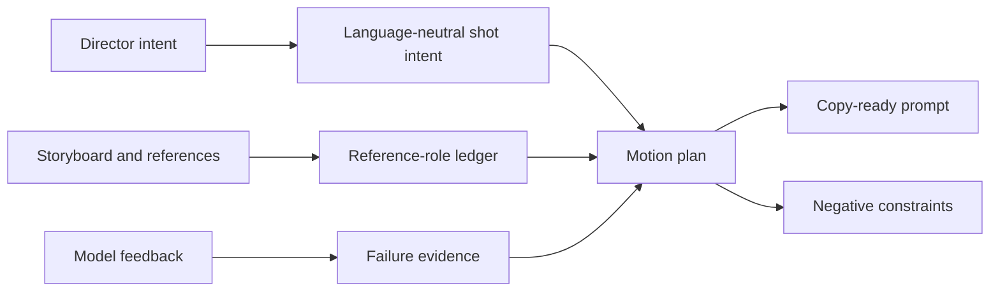

# Motion-First Prompt Compilation

## Purpose

Video prompting is a control-compilation problem. A director brief, storyboard,
reference set, and model result do not arrive in the order a generation model needs.
They must be normalized into explicit reference bindings and a physically coherent
motion sequence.

This layer is horizontal rather than a new technique rung. T0–T5 decide **how a shot
should be produced**; prompt compilation decides **how each generative pass should be
expressed**.



## 1. Why ordinary prompt writing fails

Natural-language briefs mix several different layers:

- the communication goal: what the audience should perceive;
- the physical shot: what the camera, subject, and environment actually do;
- the evidence: which image controls identity, composition, action, or look;
- the finish: light, lens character, texture, and commercial tone;
- the failure report: what the previous model run got wrong.

Passing that mixture directly to a model creates ambiguity. "An elegant woman,
cinematic, dynamic camera" names a desired impression but does not define an executable
shot. A compiler converts the impression into visible consequences: camera speed,
posture, gait, gaze, balance, fabric response, parallax, and light.

## 2. Intermediate representation

Prompt semantics should be represented before they are rendered into Chinese, English,
or model-specific syntax:

```text
ShotIntent {
  communication_goal
  shot_function
  duration_and_format
  camera_motion
  subject_motion
  scene_motion
  look
  continuity
  reference_bindings
  hard_constraints
  soft_preferences
  observed_model_failures
}
```

This separation matters because language is an output format, not the control logic.
The same shot can be rendered as a concise English prompt, a Chinese prompt with
English production terms, or a model-specific template without changing its meaning.

## 3. Reference images are typed inputs

Every reference must have an explicit role. An image may carry multiple roles, but no
role should be inferred silently.

| Reference role | What it controls |
|---|---|
| First / middle / final frame | A timed spatial state |
| Composition reference | Layout, balance, and blocking only |
| Camera reference | Viewpoint, height, lens feel, or camera path |
| Action reference | Pose, gesture, gait, or motion path |
| Look reference | Lighting, palette, contrast, and texture |
| Character identity | Face, body identity, silhouette, or design |
| Wardrobe reference | Garment, styling, accessories, and material |
| UI / packaging reference | Interface, pack, label, logo, and graphic system |

The critical rule is:

> A composition reference is not a first frame or final frame unless the director
> explicitly assigns that additional role.

When a reference role is unresolved and would materially change generation, the
compiler asks one narrow question before writing the prompt.

## 4. Motion is the priority stack

Render the positive prompt in this order:

```text
reference bindings
→ camera movement
→ subject motion
→ scene motion
→ look and capture character
→ continuity constraints
```

### Camera movement

Describe only the variables that determine the shot: camera height and angle, shot
size, path, axis, direction, speed, acceleration, stabilization character, and the
dominant operation. Handheld amplitude, footstep bounce, horizon roll, whip behavior,
and motion blur belong here when intentional.

One dominant move plus one supporting behavior is normally clearer than a list of
every camera term. Physically incompatible operations must be resolved rather than
passed through.

### Subject motion

Define travel direction, speed, step rhythm, center-of-gravity transfer, relevant
limb and torso behavior, expression, gaze, and start-to-end continuity. Use visible
verbs instead of performance adjectives.

### Scene motion

Specify environmental response separately: hair, fabric, rain, smoke, crowds,
reflections, screens, contact effects, and foreground/background parallax. Its timing
and intensity should agree with camera and subject speed.

### Look

Only after motion is solved, add light direction and softness, contrast, palette,
exposure behavior, lens character, depth of field, shutter feel, grain, material
fidelity, and the required advertising finish.

## 5. Positive prompt and Negative

Positive text describes the desired behavior. Where possible, replace prohibitions
with executable alternatives:

```text
Instead of: no shaky camera
Write: stable low-amplitude handheld follow
```

Residual failure controls are collected into one `Negative:` line: identity drift,
anatomy corruption, unintended cuts, temporal flicker, frame warping, unreadable text,
or another model-specific risk. Negative should not repeat the positive prompt.

The default delivery contract is deliberately small:

```text
<one copy-ready positive prompt paragraph>
Negative: <compact failure constraints>
```

No analysis, alternatives, parameter tables, or preface are emitted unless requested.

## 6. Model-feedback revisions

Treat a failed generation as evidence about one control layer:

| Observed failure | Revise first |
|---|---|
| Wrong viewpoint or camera path | Camera clause |
| Weak, vague, or discontinuous action | Subject-motion clause |
| Hair, fabric, rain, or parallax feels frozen | Scene-motion clause |
| Identity or wardrobe drifts | Reference binding and continuity |
| Lighting or finish is wrong | Look clause |
| Flicker, warping, duplicate limbs | Negative and, if persistent, pipeline rung |

Do not rewrite the entire prompt when one layer failed. Preserve approved clauses as
frozen inputs, following the repository's wider escalation discipline.

## 7. Validation

Before a prompt is ready:

1. Every supplied reference has a role.
2. No composition reference was promoted to a frame anchor.
3. Camera, subject, scene, and look appear in canonical order.
4. Camera operations are physically compatible.
5. Motion has direction, timing, and continuity.
6. Every adjective changes a visible property.
7. Hard constraints survive compression.
8. Negative contains failure controls, not a second prompt.
9. The result is directly copyable.

## Agent implementation

The executable behavior is packaged in
[`compile-video-prompt`](../../skills/compile-video-prompt/SKILL.md). Its normative
contract is written in English and loaded only when the Skill is invoked. The public
playbook documents the method; it does not reproduce a personal ChatGPT Project
instruction or depend on a particular chat product.
