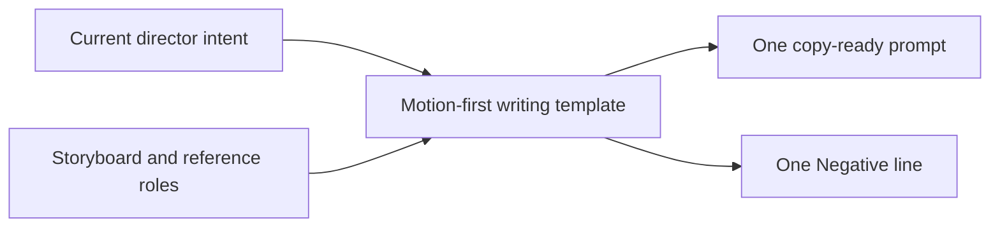

# Motion-First Video Prompt Template

## Purpose

This chapter defines a reusable writing template for one video-generation prompt. It
turns the current director brief, storyboard, and reference images into one concise,
copy-ready text.

It is deliberately not a prompt-iteration system. It does not inspect generated
results, diagnose model failures, compare versions, preserve successful clauses as
state, or manage an optimization loop.



This template is horizontal across T0–T5. The technique ladder decides how a shot is
produced; the template only writes the prompt for the current generative step.

## 1. Default template

Fill the prompt in this order:

```text
[REFERENCE BINDINGS, when references exist]
[CAMERA MOVEMENT];
[SUBJECT MOTION];
[SCENE MOTION];
[LOOK AND FINISH];
[CONTINUITY, only when essential].
Negative: [COMPACT FAILURE RESTRICTIONS]
```

Render the filled fields as one paragraph followed by one `Negative:` line. Do not
print the bracketed field names.

The order is intentional. Camera movement defines the moving viewpoint. Subject motion
defines the main action inside that viewpoint. Scene motion adds environmental
response. Look finishes an already coherent shot.

## 2. Turn intent into visible direction

A short creative phrase often states an impression rather than a physical shot:

```text
An elegant woman, cinematic, dynamic camera.
```

Rewrite each meaningful word as something visible:

| Abstract intention | Visible direction |
|---|---|
| Elegant | Upright relaxed posture, measured pace, controlled weight transfer, calm gaze |
| Energetic | Faster camera acceleration, longer steps, stronger body commitment, active environment |
| Premium | Restrained camera behavior, controlled highlights, material fidelity, clean composition |
| Intimate | Closer shot size, reduced camera distance, subtle expression, shallow spatial separation |

Use one visible consequence per retained modifier. Remove invisible backstory and
decorative synonyms that do not change the frame.

## 3. Give every reference an identity

Every supplied reference must have an explicit role:

| Reference role | What it controls |
|---|---|
| First / middle / final frame | A required state at a particular point in the shot |
| Composition reference | Layout, balance, and blocking only |
| Camera reference | Viewpoint, height, lens feel, or camera path |
| Action reference | Pose, gesture, gait, or motion path |
| Look reference | Lighting, palette, contrast, texture, or finish |
| Character identity | Face, body identity, silhouette, or design |
| Wardrobe reference | Garment, styling, accessories, or material |
| UI / packaging reference | Interface, product pack, label, logo, or graphic system |

One image may carry multiple roles, but every role must be stated. A composition
reference is not a first frame, middle frame, or final frame unless the director
explicitly assigns that additional role.

Keep bindings narrow:

- an identity reference does not automatically contribute its background or clothing;
- a wardrobe reference does not redefine the face or body;
- a look reference does not redefine composition or product design;
- a UI/packaging reference controls the named graphic or product elements only.

When references exist, open the prompt with a compact role statement:

```text
Reference A defines character identity and wardrobe; Reference B controls composition
only; Reference C defines lighting and color.
```

## 4. Write camera movement first

Select only the camera variables that determine this shot:

- camera height and angle;
- shot size and lens feel;
- path, axis, and screen direction;
- speed and acceleration;
- stabilization character;
- pan, tilt, roll, dolly, truck, crane, orbit, follow, or whip behavior;
- handheld amplitude, footstep bounce, horizon roll, and motion blur when intentional.

Prefer one dominant move plus one supporting behavior. Do not paste a list of camera
terms. Resolve physically incompatible operations before writing.

Examples:

```text
Eye-level medium full shot, slow steady dolly-in with subtle lateral tracking.
```

```text
Low handheld follow from behind, brisk walking pace, small footstep bounce, slight
horizon roll, natural directional motion blur.
```

## 5. Write subject motion second

Describe a continuous physical action:

- direction and speed;
- step length, rhythm, balance, and center-of-gravity shift;
- relevant hand, arm, leg, torso, head, expression, and gaze behavior;
- opening state, transition, and ending state;
- interaction timing with another person, prop, product, or surface.

Use visible verbs. Replace "moves gracefully" with the body mechanics that make the
motion read as graceful.

## 6. Write scene motion third

Keep environmental motion separate from subject motion:

- hair, fabric, wind, smoke, rain, dust, reflections, crowds, vehicles, and screens;
- foreground and background parallax;
- contact effects and environmental response;
- timing and intensity relative to the camera and subject.

Scene motion should support the shot, not exist merely to make the prompt sound
cinematic.

## 7. Write look last

Add visual finish after motion is clear:

- light direction, softness, contrast, and exposure behavior;
- palette and atmosphere;
- lens character, depth of field, shutter feel, motion blur, grain, and texture;
- skin, fabric, product, UI, or packaging treatment;
- advertising finish and visual continuity when relevant.

Avoid synonymous adjective stacks. Every look term should change a visible property.

## 8. Positive prompt and Negative

Describe the desired behavior positively whenever possible:

```text
Instead of: no shaky camera
Write: stable low-amplitude handheld follow
```

Collect remaining failure restrictions into one compact `Negative:` line. Choose only
risks relevant to the current shot, such as identity drift, anatomy errors, foot
sliding, unintended cuts, camera jitter, temporal flicker, frame warping, unreadable
text, or duplicate limbs.

Do not paste the same generic negative list into every prompt.

## 9. Language

The template is independent from output language:

- use the language explicitly requested by the user;
- otherwise mirror the user's working language;
- keep established camera and production terms in English when they are clearer;
- fully English output is valid;
- keep asset filenames and required model syntax unchanged.

Changing language must not change reference roles or the camera → subject → scene →
look order.

## 10. Final check

Before returning the prompt:

1. Every supplied reference has an explicit role.
2. A composition reference was not promoted to a frame anchor.
3. Camera movement appears before subject and scene motion.
4. Camera operations are physically compatible.
5. Subject action has direction, timing, and continuity.
6. Scene motion is distinct from subject motion.
7. Look appears last and does not replace movement.
8. The positive paragraph is compact and mostly positive.
9. `Negative:` contains only relevant restrictions.
10. The output can be copied without removing commentary.

## 11. Example

Input:

```text
非常优雅的女孩
```

Output:

```text
Eye-level medium full shot, a slow steady dolly-in with subtle lateral tracking, clean horizon and restrained motion blur; a poised young woman walks diagonally toward camera at a measured pace, shoulders relaxed, spine tall, short even steps, controlled weight transfer, one hand lightly guiding her skirt, calm expression and focused gaze continuing smoothly through the shot; her hair and soft fabric respond gently to the movement while the background holds slow natural parallax; soft directional key light, refined neutral palette, delicate highlight roll-off, shallow depth of field, polished luxury-advertising finish.
Negative: identity drift, stiff gait, foot sliding, abrupt gesture changes, exaggerated posing, camera jitter, horizon wobble, temporal flicker, warped hands, duplicate limbs
```

## Agent implementation

The loadable writing template is packaged in
[`write-video-prompt`](../../skills/write-video-prompt/SKILL.md). Its internal
specification is written in English and does not expose its interpretation process in
the default output.
