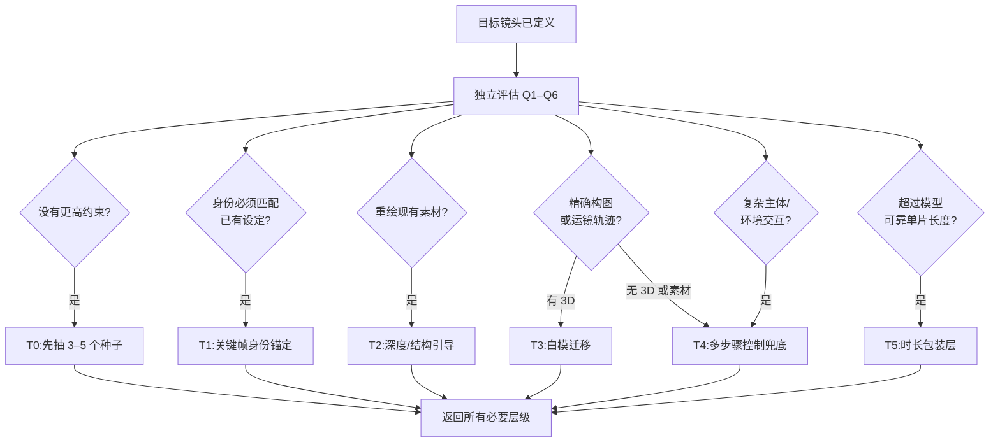

# 00 — 决策框架:你的目标画面该用哪种技术?

> **本仓库的核心观点:** 不要从你喜欢的工具出发,要从你需要的画面出发。
> 先把目标镜头拆解成需求,再路由到满足这些需求的最简流水线。
> 你在单次生成里每多塞一个要求,失败率就成倍上升。

[English version](../en/00-decision-framework.md)

---

## 1. 复杂度预算

每个视频生成模型在单次采样中都有一笔隐性的**复杂度预算**。一条提示词如果同时要求:

- 特定的角色身份,**以及**
- 精确的运镜,**以及**
- 特定的风格,**以及**
- 精确的构图,**以及**
- 30 秒以上的时长,**以及**
- 主体与环境之间干净的交互(接触、遮挡、反射)

……那么它失败的次数会远多于成功。不是模型不行,而是你让一次采样同时满足六个约束。

**多步骤 AIGC 的意义,就是一次只花一个维度的预算。** 生成背景时不用管角色;
生成角色时不用管背景;中间穿插降噪、超分、风格化;最后再合成。
每一遍只扛一到两个约束,验收通过后就冻结为下一步的输入。
下游失败时只重试当前步骤,不用把整个镜头重新生成。

代价是编排:步骤更多、中间产物更多、跑偏的机会也更多。
这个框架的作用,就是告诉你什么时候值得付这个代价。

## 2. 六个路由问题

在碰任何工具之前,先针对你的**目标画面/镜头**回答这六个问题:

| # | 问题 | 路由意义 |
|---|------|----------|
| Q1 | 最终镜头多长? | 超过所用模型已经验证的可靠单片长度时加入 T5;不要硬编码一个通用的 10 秒上限。 |
| Q2 | 主体在镜头之间/帧之间必须**保持完全一致**吗? | 角色一致性是拆分生成的头号理由。 |
| Q3 | 需要精确控制构图/运镜吗? | "精确"意味着上结构引导(深度、白模、3D 预演),而不是堆提示词。 |
| Q4 | 主体与环境有交互吗(接触阴影、遮挡、反射)? | 必须准确呈现的交互会加入 T4;Q3/Q5 需要的结构引导仍可与它组合。 |
| Q5 | 目标是写实、风格化,还是对已有素材做风格迁移? | 迁移 → 视频到视频;从零生成 → 文/图生视频。 |
| Q6 | 每个最终成片的秒数,你愿意花多少算力/时间? | 成本由处理遍数、重试、重叠区和人工 QA 共同累积;应估算这些输入,不要套一个通用倍数。 |

## 3. 技术阶梯

从最便宜(先试)到编排最重(便宜的失效后再用)排序。详见各链接文档。

| 阶梯 | 技术 | 职责 | 文档 |
|------|------|------|------|
| **T0** | 单次文生视频 | 没有更高约束时的基线。 | *(外部工具)* |
| **T1** | 图生视频(关键帧锚定) | 身份锚定层,可与 T3/T4/T5 组合。 | *(外部工具)* |
| **T2** | 深度/结构引导视频 | 利用现有素材提供结构。 | [02](02-depth-video.md) |
| **T3** | 白模迁移 | 有 3D 白模时锁定精确几何与运镜。 | [01](01-clay-render-transfer.md) |
| **T4** | 多步骤合成 | 负责交互和分元素控制。 | [03](03-multistep-video-generation.md) |
| **T5** | 长镜头链式拼接(一镜到底) | 包在分段管线外面的时长包装层。 | [04](04-long-take-continuous-shot.md) |

阶梯之间可以组合。真实生产管线常常是:环境用 T3,主体与背景结合用 T4,
时长用 T5 拉到最终长度。

## 4. 可组合路由图

不要在第一个"是"就停下。返回路线之前要**评估全部六个约束**。
T1、T4、T5 经常叠加在结构路线之上;T5 是时长包装层,
不能替代每个片段内部的身份、几何或交互处理。

按以下顺序应用:

1. 已有主体设计必须保持一致时,加入 **T1**。
2. 现有素材已经拥有正确运镜和几何时,加入 **T2**。
3. 否则,精确运镜/几何且有 3D 白模时加入 **T3**;
   既没有素材也没有 3D 时,用 **T4** 做可控兜底。
4. 接触、遮挡、反射等复杂交互需要分元素生成与合并时,加入 **T4**。
5. 分段管线还要跨越可靠单片长度时,在外层加入 **T5**。
6. T1–T5 都不需要时,才返回 **T0**。

可执行参考见 [`scripts/route-shot.mjs`](../../scripts/route-shot.mjs),
回归案例见 [`tests/routing.test.mjs`](../../tests/routing.test.mjs)。

## 5. 场景路由表

| 你的目标画面 | 路由 | 原因 |
|---|---|---|
| 5 秒氛围空镜,无指定角色 | T0 | 没有需要保持一致的对象,抽种子很便宜。 |
| 产品主镜头,结尾必须精确落版 | T1(尾帧锚定) | 只有最后一帧必须精确。 |
| 把实拍航拍变成动画风 | T2(深度+风格) | 几何已经正确,只改外观。 |
| 精确轨道镜头穿过风格化城市 | T3 | 运镜轨迹是 3D 问题,靠提示词只会漂移。 |
| 已有设定角色穿过生成的森林并触摸一棵树 | T1 + T4 | T1 锚定角色设定;接触交互增加分元素控制和合并。 |
| 10 分钟一镜到底 MV | T5 叠加在 T3/T4 之上 | 没有模型能保持分钟级连贯,必须分段+锚点。 |
| 30 秒已有角色,精确推轨并触摸反光玻璃 | T1 + T3 + T4 + T5 | 身份、运镜、交互、时长是独立约束,谁也不能替代谁。 |
| 口播特写带唇形同步 | 专用工具,不在本体系内 | 唇形是独立预算,别放进通用管线里付。 |

## 6. 升级纪律

多步骤工作流最常见的失败模式是**过度升级**:
明明 Kling 抽第三个种子就能过的镜头,却搭了一张 12 节点的 ComfyUI 图。

经验法则:

1. **先在便宜的阶梯上花 15 分钟。** T0/T1 抽 3–5 个种子才算公平试验;一个不抽不算。
2. **升级前先说出是哪个约束失败了。** "看着不对"不是约束;"角色在两镜之间换脸了"才是——它路由到 T1/T4,而不是更长的提示词。
3. **一次只升级一个维度。** T0 一致性失败,先加关键帧锚定(T1),别急着整条管线搬进 ComfyUI。
4. **冻结已通过的产物。** 一旦某一步产出了合格中间件(干净的背景板、满意的角色转面图),就把它当作下一步的固定输入。已经验收过的步骤,绝不在下游重新生成上游产物。

## 7. ComfyUI 的位置

ComfyUI 不是阶梯上的一级——它是**阶梯之间的工作台**。在本手册里它的职责是外科手术式的,而不是从零生成:

- 管线中段的**降噪/重打光**,让贴上去的主体与背景板光影融合;
- 分别生成的元素在**潜空间合并**;
- 对已验收帧做**超分+补细节**;
- 为 T2/T3 提取**深度/姿态**。

配方见 [05 — ComfyUI 集成模式](05-comfyui-integration.md);
每个步骤在多步链中的位置见 [03](03-multistep-video-generation.md)。

## 8. 框架自身的失效模式

- **按新奇度路由** —— 因为白模迁移好玩就选 T3,而不是因为镜头需要。决策树只在约束要求时才向右走。
- **无视 Q6** —— 只播一次的镜头配 50 步管线就是亏损。预算是真实约束,放进路由里。
- **把决策树当静态的** —— 模型能力每月都在变。当某个新模型能稳定同时满足两个约束时,就合并对应分支。(这正是 [CONTRIBUTING](../../CONTRIBUTING.md) 鼓励的更新类型。)

---

**下一篇:** [01 — 白模迁移](01-clay-render-transfer.md)
