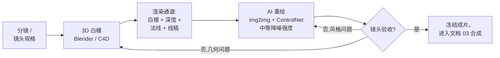

# 01 — 白模迁移(Clay-Render Transfer)

[English version](../en/01-clay-render-transfer.md)

> **这是什么:** 先用一张无贴图的 3D 渲染——Blender/C4D 白模或预演渲出的"素模"——
> 锁死镜头的几何,再让 AI 把它重绘成最终风格。几何、运镜轨迹、构图布局全程不动。
> 复杂度预算只花在外观这一个维度上;结构早在 3D 里付过钱了。

这是[技术阶梯](00-decision-framework.md#3-技术阶梯)上的 **T3**。

---

## 什么时候用

当路由问题这样回答时,用白模迁移:

- **Q3(精确构图/运镜):是。** 你需要一条特定的推轨、摇臂或手持轨迹,
  或者构图必须逐帧对齐分镜。运镜轨迹是 3D 问题,靠提示词只会漂移。
- **Q2(一致性):环境必须在多个镜头或一段长运动里保持完全一致。**
  3D 场景是确定性的——同一个场景从任何角度渲出来都一样,永远都是。
- **Q4(交互):你计划之后把主体合成进这个环境**(T4,见[文档 03](03-multistep-video-generation.md))。
  重绘后的白模序列就是一块几何已知的稳定环境板——而且深度通道你已经免费拿到了。
- **Q1:时长不限。** 因为你是渲出白模帧序列再逐帧处理。长度只增加算力,不损失连贯性。

典型目标:精确运镜穿过风格化城市、带明确美术方向的建筑漫游、严格对齐分镜的动作场面布局。

## 什么时候不要用

- **没有精确运镜或构图要求。** 如果"黄昏的森林,镜头缓慢前推"就够用,T0/T1 在成本上完胜。
  视频模型抽 3–5 个种子是几分钟的事;搭白模是几小时。
- **你手里已经有实拍素材。** 几何已经在真实视频里了,直接提取深度做迁移——那是 T2
  ([文档 02](02-depth-video.md))。把本可以深度引导的素材在 3D 里复刻一遍,等于同一笔预算付两次。
- **有机的混乱本身就是卖点。** 火焰、人群、水面、风中的植被——白模很难描述这些东西,
  重绘阶段反正要现编画面的大部分内容。那是 T0 的活,一条提示词更便宜。
- **团队没人会建模。** 粗糙的白模一天能学会搭得很难看,一周才能搭得好。
  如果镜头只播一次、"差不多"就能过,那一周就是亏损(Q6)。

## 流水线

### 1. 搭白模——要快

- 几何体级别的细节就够了。楼用方块、柱子用圆柱、车用低模代理。
  表面细节由 AI 现编;白模只需要扛住**体量、透视和布局**。
- **先对镜头焦段,别的都靠后。** 把 Blender/C4D 里的相机焦距设成目标镜头的焦段
  (比如广角空镜运动用 24mm,压缩感推轨用 50mm 以上)。透视会被烘进下游每一个通道;
  焦段错了,后面全错。
- 现在就定好最终画幅比例和分辨率。重绘阶段对你给什么就重采样什么;重采样两次就是丢细节。
- 大致比例对深度很重要:门要大致是门的尺寸,深度渐变才能被 ControlNet 正确读取。
- 预算:熟手搭单个场景 2–8 小时。如果白模搭了两天还没完,看下面的失效模式。

### 2. 导出各通道

同一台相机、同一个帧范围,导出:

- **白模渲染** —— 无贴图的颜色通道。中性灰材质,一盏柔和主光或平光环境光。
  这是 img2img 的输入。
- **深度** —— z-depth 通道,按**整段镜头**归一化(不是逐帧——逐帧归一化会导致深度呼吸)。
  喂给 ControlNet depth。
- **法线** —— 表面朝向。可选,但在大平面上能稳定光影——深度单独看这些地方是含糊的。
- **线稿** —— 用 3D 软件的 freestyle/描边渲染,或在白模帧上跑线稿预处理器。
  喂给第二个 ControlNet 单元,钉住轮廓和硬边。

静帧各导一张;视频各导完整序列,命名一致、帧号一致。

### 3. 重绘阶段

在 ComfyUI 里逐帧处理(静帧或视频通用):

1. `Load Image`(白模帧)→ `VAE Encode` → `KSampler`(img2img)→ `VAE Decode`。
2. `ControlNet Apply` 接深度图(权重 ~0.8–1.0 作为起点)。
3. 第二个 `ControlNet Apply` 接线稿(权重 ~0.5–0.7 作为起点),钉住深度图抓不住的边缘。
4. 提示词只写风格和材质:"粗野主义混凝土城市,阴天,湿沥青,体积雾"——
   绝不写布局。布局是输入图的职责。
5. **降噪强度(denoise)甜区大致在 0.45–0.65。** 低于 ~0.45,输出基本还是蒙了一层
   贴图滤镜的灰白模;高于 ~0.65,模型开始动几何——窗户搬家、屋顶线弯曲、透视漂移。
   在这个区间里按镜头微调;这些数字是起点不是保证,而且会随模型和 ControlNet 强度变化。
   截至 2026 年,以你所用模型的当前文档为准。

先验收一张主帧,再跑批量。在单帧上把风格调对,然后冻结提示词、种子策略和权重。

### 4. 视频逐帧处理:时间一致性

逐帧 img2img 默认会闪。缓解手段,从最便宜的开始:

- **全序列共享种子。** 同一个种子、同一条提示词、同一组参数——只有输入帧在变。
  光这一条就能消除大部分高频闪烁。
- **整段锁死 ControlNet 权重和采样器参数。** 任何逐帧变化的引导强度都会变成可见的脉动。
- **生成后做去闪烁(deflicker)**(剪辑软件里的时间平滑插件,或专用的 deflicker 节点/脚本)。
  把它当抛光,不当解药。
- **对输出做光流检查。** 计算相邻重绘帧之间的光流,和相邻白模帧之间的光流对比。
  凡是重绘光流明显偏离白模光流的地方,就是模型在那帧动了几何——把这些帧用更低的
  降噪强度或更高的 ControlNet 权重重跑,而不是整段重跑。
- 如果闪烁仍然过不了验收,升级为接受结构引导(逐帧深度/线稿)的视频模型,
  替代逐帧 img2img。这是用一次带原生时间注意力的采样换掉 ComfyUI 工作台——
  截至 2026 年,已有多款视频模型接受逐帧控制输入;以当前文档为准。

### 5. 交接给合成

验收后的重绘序列就是你的**环境板**。冻结它。它作为背景进入
[03 — 多步骤合成](03-multistep-video-generation.md),主体将被合并进去——
而且因为场景是你搭的,T4 合成做遮挡和中段降噪需要的深度通道你手里已经有了。
一旦下游步骤基于这块板通过了验收,绝不再重新生成它。

## 失效模式

- **高降噪下风格渗入几何。**
  症状:窗户在墙上逐帧爬动;屋顶线弯曲;第 80 帧的房间比第 1 帧不易察觉地大了一圈。
  原因:降噪强度超过几何保持阈值(典型 ControlNet depth 下大致 >0.65),
  或 ControlNet 权重太低,钉不住结构。
  修复:把降噪降回 0.45–0.65 区间,深度 ControlNet 权重往 1.0 抬,补上线稿单元。
  只重跑受影响的帧,不要重跑整段。

- **帧间时间闪烁。**
  症状:纹理沸腾、光影脉动、小物件忽隐忽现,但布局没动。
  原因:逐帧采样方差——种子不同,或批量跑的时候参数漂移。
  修复:全段共享种子,锁死采样器/ControlNet 参数,最后去闪烁当抛光。
  用光流检查验证;只重跑有问题的帧。

- **白模做得过细,白白浪费好几天。**
  症状:还没跑过一次 AI,就花了一周建窗框、瓦片和道具。
  原因:把白模当成了最终 3D 交付物,而不是几何载体。凡是 AI 反正会现编的细节,
  建了就是同一笔预算付两次。
  修复:止步于体量 + 焦段 + 比例。开工两小时后就拿几何体级白模试一次重绘;
  只在重绘明确读错形状的地方补几何(比如模型把一面平墙读成了一条街)。

- **白模与目标镜头的相机/焦段不匹配。**
  症状:重绘本身没问题,但镜头感觉不对——空间相对分镜过深或过平;
  后面合成进去的角色怎么都坐不进场景里。
  原因:白模相机的焦距或机位高度与目标镜头不符;透视已烘进每个通道,
  下游无法修复。
  修复:回 3D 里修,别在提示词里修。重设相机、重渲各通道。
  这是唯一一个合理退回第 1 步的失效模式。

- **运动镜头上的深度呼吸。**
  症状:一段运动中,表观深度范围在"呼吸";远处几何前后跳。
  原因:深度按逐帧归一化导出,第 N 帧的远平面和第 N+1 帧不一样。
  修复:深度通道按整个帧范围统一归一化一次(固定近/远平面数值),重新导出。

## 成本说明

以一个 5 秒镜头为例,相对单次 T0 的大致倍数:

- **白模:** 几何体级场景 2–8 小时人工(每个场景一次性;该场景上所有镜头复用)。
- **重绘算力:** 每帧约等于 1.0–1.5 次单次 img2img——两个 ControlNet 单元比一次
  纯 KSampler 多不了多少。120 帧就是 120–180 个单次等效,外加光流检查标出的
  重跑帧(通常占整段的 5–15%)。
- **去闪烁 + 光流检查:** 分钟级算力,相对生成可忽略。
- **总计:** 算力大致是一次视频生成 pass 的 5–10 倍,外加白模人工。当 Q3 要求
  精确运镜时是值得的——T0 去赌一条精确推轨,通常烧掉 10 个以上种子还落不了轨迹,
  构图也保不住。

---

**上一篇:** [00 — 决策框架](00-decision-framework.md) ·
**下一篇:** [02 — 深度引导视频](02-depth-video.md)
