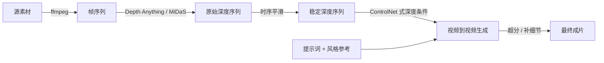
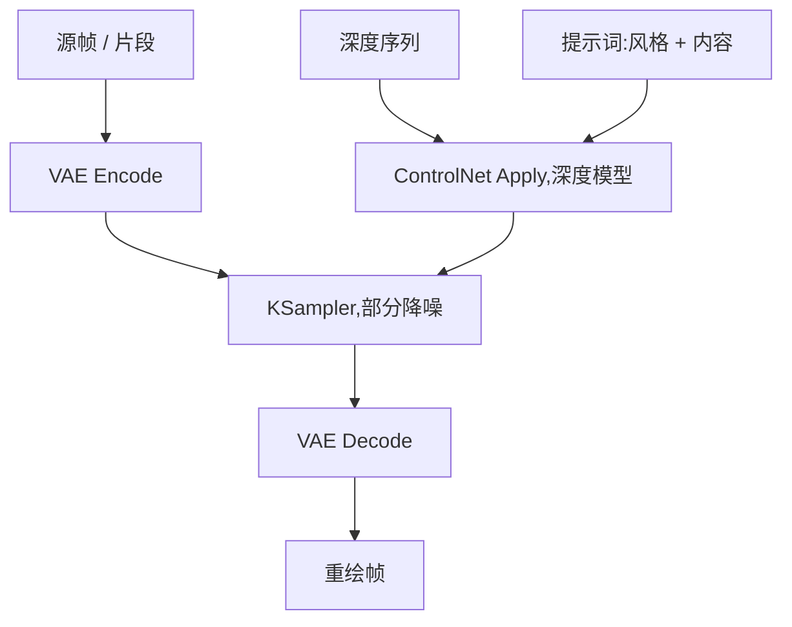

# 02 — 深度视频(Depth-Guided Video)

逐帧深度图作为结构方向盘:从源素材(或 3D 渲染)中提取深度,喂给视频到视频生成,让几何锁死、只改外观。这是阶梯上的 **T2** 一级。

[English version](../en/02-depth-video.md)

---

## 这是什么

深度图是一张逐像素的距离图:近处亮、远处暗(或者反过来——约定不统一,以你的节点为准)。深度估计模型(Depth Anything、MiDaS)或 3D 渲染器(Blender 的 Z 通道、Mist 通道)可以给你逐帧的深度图。把这个序列喂给深度条件化的视频模型——通常是视频扩散模型上加一个 ControlNet 式适配器——模型就能在不挪动任何墙的前提下重绘素材。

分工很明确:**深度管几何,提示词管外观。** 复杂度预算的一个维度,用预先算好的产物来支付,而不是靠抽种子的运气。

## 什么时候用

当你的 Q1–Q6 答案是下面这样时,路由到这里:

- **Q5 = 对已有素材做风格迁移。** 这是核心场景。实拍航拍 → 动画风;手机拍的街景 → 赛博朋克。源素材的几何本来就是对的,你只想改外观。见 [00](00-decision-framework.md) 的路由表:"把实拍航拍变成动画风 → T2"。
- **Q3 = 构图不允许漂移。** 源素材的运镜和布局已经验收通过。即使重绘强度很高,深度也能把生成摁在这些墙之内。
- **Q2 = 中等要求。** 深度锁的是结构,不是身份。角色的轮廓能保住,脸部细节保不住——除非加更多条件(见下文"角色入场:深度 + 姿态/线稿")。
- **Q1 = 短到中等时长。** 你的视频模型能稳定承受的单片长度。更长就套在 T5([04](04-long-take-continuous-shot.md),一镜到底)下面做链式拼接。
- **Q6 = 付得起约 1.5–3 倍单次成本。** 你要付的是提取加一次条件化生成。

## 什么时候不要用

- **你不是迁移,而是从零生成。** 如果没有一份你信任其几何的源素材,深度就没有东西可驾驭。路由到 T0/T1;或者搭一个白膜走 T3([01](01-clay-render-transfer.md),白膜迁移)——白膜渲染给你的是**精确**几何,估计出来的深度图只是一个猜测。
- **改动很小。** 调色、轻度风格化、小幅清理:一次不加任何条件的低降噪视频迁移更便宜,而且常常够用。先在那里花 15 分钟(升级纪律第 1 条)。
- **素材里大半是透明/反射表面。** 玻璃幕墙、水面、镜子、镀铬。深度估计模型在这些地方会产生幻觉,引导变成噪声。要么手工修深度,要么换路线。
- **需要锁定角色身份。** 深度保的是轮廓,不是脸。如果角色必须完全一致,那是 T4 的问题([03](03-multistep-video-generation.md))——单独生成角色再合并。

## 流水线



### 1. 拆帧

按你要生成的帧率,把源素材拆成帧序列:

```bash
ffmpeg -i source.mp4 -vf fps=24 frames/%05d.png
```

用 PNG 不用 JPEG——深度估计对平坦渐变区域里的压缩伪影很敏感。这一步先保留源分辨率,生成分辨率到第 4 步再定。

### 2. 逐帧提取深度

对整个序列跑深度估计。两个实用选项:

- **Depth Anything** —— 当前单目估计的默认选择,室内外素材都比较稳。在 ComfyUI 里它作为 ControlNet Apply 的预处理器节点提供,也可以独立批量跑。
- **MiDaS** —— 老牌主力,仍然可用,细节表现一般弱一些。
- **3D 渲染深度** —— 如果源素材是 Blender/CG 预演,直接跳过估计:渲染 Z 通道或 Mist 通道。它精确、无闪烁、天然对齐,是你能拿到的最好的深度。

截至 2026 年,深度模型迭代很快——批量处理长片之前,先查当前文档确认最强的估计器。

批量处理整个序列;工具链允许的话存成 16 位 PNG(8 位在墙面、天空这类大面积平面上会出现肉眼可见的色带)。

### 3. 稳定深度序列

单目深度估计逐帧独立处理,帧间的估计噪声很小,但一旦拿来驾驭生成,就会变成可见的闪烁。先生成前先稳定,从便宜到贵:

1. **时序平滑** —— 短窗口加权平均相邻帧(比如 3–5 帧)。便宜,会轻微模糊快速运动。
2. **光流引导平滑** —— 用估计的光流把上一帧深度 warp 到当前帧再融合。比朴素平均更能保住运动边缘。
3. **去闪烁(deflicker)** —— 把深度序列当素材过一遍视频 deflicker 滤镜。
4. **EBSynth 式传播** —— 手工修几张关键帧深度,用 patch-match 传播把修正扩散到整个序列。人工量最大,只用于主镜头里必须精确的区域(一张脸、一个门洞)。

检验方法:把深度序列当视频拖进度条看。深度里看得到的闪烁,输出里就会变成爬动的边缘。

### 4. 带深度条件生成

在 ComfyUI 里,图的形状是:



起点参数——明确说是起点,从这里调:

- **降噪强度 0.55–0.75** 用于彻底重绘;轻度重绘用 0.35–0.5。越低保留越多源纹理(也保留越多源瑕疵)。
- **ControlNet 深度强度 0.7–1.0** 起步;有些图会让它随采样步数衰减,让模型在后期自由发明表面细节。
- **按深度图的原生长宽比生成。** 分辨率不匹配是真实的失效模式——见下文。
- ControlNet 深度模型要和你的基础视频模型同族。给图像模型训练的深度适配器,不自动适用于视频模型;截至 2026 年,用之前查一下当前有效的适配器/模型搭配。

### 5. 角色入场:深度 + 姿态/线稿

只有深度,锁住的是布景,锁不住演员。画面里有人、且人物轮廓必须挺过重绘时:

- **深度 + OpenPose**:深度驾驭环境,姿态驾驭身体。两个 ControlNet 单元都用中等强度(各约 0.7 起步),而不是一个拉满——两个强条件互相打架,两个中等条件互相配合。
- **深度 + canny/lineart**:当角色的**服装和边缘**比骨架更重要时(比如人偶服、手里的产品)。canny 保轮廓,深度保房间。
- 预算原则:每加一个条件,同一次采样就多扛一个约束。两个通常没问题;三个开始侵蚀提示词的影响力,成片率下降、要靠挑片补。如果你真的需要深度 + 姿态 + 身份三者同时成立,那就是拆镜头上 T4 的信号。

### 6. 收尾

重新组帧(`ffmpeg -framerate 24 -i out/%05d.png ...`),然后对验收通过的成片做超分 + 补细节。进入下一步之前冻结已验收片段——绝不要从已经重绘过的输出里重新提取深度去喂下一轮重绘,伪影会复利式叠加。

### 附加:深度作为调色工具

同一个深度序列,在生成**之后**的合成/调色环节同样有用:

- **景深** —— 用深度图驱动逐像素模糊。比让模型"加点 bokeh"更便宜、更可控,而且因为它来自几何而非采样,剪切点之间不会跳。
- **空气雾 / 大气透视** —— 按深度向雾色插值。风光和城市镜头立刻出体量感。
- **重打光蒙版** —— 按深度阈值切出的 matte(近处主体 vs. 远处背景),让你不画 rotoscoping 就能分开调主体和环境。

这些步骤是确定性的:零采样、零种子。当一个效果能在调色里做到时,就在调色里做。

## 失效模式

**细碎结构上深度闪烁(头发、树叶、栅栏、电线)**
→ 原因:逐帧估计噪声在细小高频结构上最大,每一帧对头发边缘在哪的判断都不一致。
→ 修复:生成前先做深度序列稳定(第 3 步);如果只有某个区域闪,把该区域从深度引导里 mask 掉,或用 EBSynth 式传播从手工修好的关键帧补。最后手段是降低这几帧的深度条件强度,让提示词扛这个区域。

**透明/反射表面击穿深度估计器**
→ 原因:单目估计器靠纹理和明暗线索推深度;玻璃、水面、镜子、镀铬返回的是**反射中场景**的深度,而不是表面的深度。
→ 修复:手工补画这些区域的深度(在正确的平面上抹一块平灰常常就够了),或者 rotoscoping 一张修正后的深度板。如果镜头**主要**由这类表面构成,离开 T2——这种引导比没有引导更糟。

**深度与提示词冲突(深度说是墙,提示词说是窗)**
→ 原因:你在让这一次采样违背它自己的条件。采样器只能妥协:墙上糊一团窗形状的污渍,或者帧间几何漂移。
→ 修复:改一边,不要两边都改。要么改深度图(把窗口开洞画进深度——深度只是一张图,可以用 Photoshop 修),要么改提示词去贴合几何。不要同时拉高提示词权重和深度权重,那是把冲突拉到最大。

**深度 pass 与生成 pass 分辨率不匹配**
→ 原因:深度按源分辨率提取(比如 1080p),生成却跑在视频模型的原生分辨率(比如 768×512);缩放后的深度图每条边缘都在移位、变软,细碎结构全部对不齐。
→ 修复:把深度提取或缩放到与生成分辨率完全一致,并按源素材的长宽比生成。批量跑之前,拿一张深度帧叠在生成尺寸的源帧上验证对齐。

**重绘输出在大平面上爬动、"沸腾"**
→ 原因:大面积渐变(天空、墙面)上的 8 位深度色带,叠加高降噪强度——采样器每帧都在发明新纹理。
→ 修复:尽可能按 16 位提取深度,加一点时序平滑,把降噪降到 0.5–0.6 区间。给输出做轻度 deflicker 也有用,但修深度比修视频便宜。

**角色轮廓保住了但身份漂移**
→ 原因:这是预期行为,不是 bug——深度条件的是几何,不是外观。
→ 修复:加姿态或 canny 条件(第 5 节);或者接受它,用 mask 把角色的脸排除在重绘之外,把原脸合成回去。如果跨镜头的身份一致是硬要求,升级到 T4。

## 成本说明

相对同等成片的单次文生视频,大致的成本倍率:

| 步骤 | 成本 |
|---|---|
| 拆帧(ffmpeg) | 可忽略(秒级,CPU) |
| 深度提取 | 短片约 0.1–0.3 倍一次生成;GPU 或像样的 CPU |
| 时序平滑 / deflicker | 可忽略到约 0.1 倍(EBSynth 式传播加的是人工小时,不是算力) |
| 深度条件化生成 | 约 1–2 倍单次(条件开销 + 仍然需要的重抽) |
| **合计** | **约 1.5–3 倍单次**,外加首个镜头的管线搭建时间 |

这个倍率买到的是一条硬保证——几何不漂移——这是 T0 抽多少种子都稳定给不了的。按升级纪律:如果不加条件的视频迁移抽三到五个种子就能稳住你的布局,那你本来就不需要这一级。

---

**上一篇:** [01 — 白膜迁移](01-clay-render-transfer.md) · **下一篇:** [03 — 多步骤视频生成](03-multistep-video-generation.md)
