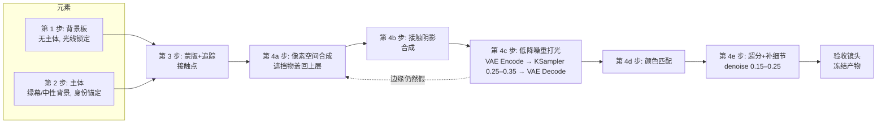

# 03 — 多步骤视频生成:拆开生成,再合并

> **这是什么:** 把背景、主体、交互分别生成为独立产物,中间用外科手术式的
> ComfyUI 步骤做合并。这是本手册的核心动作:一次只花一个维度的复杂度预算,
> 而不是让单次采样同时满足六个约束。

[English version](../en/03-multistep-video-generation.md)

阶梯位置: **T4**。上承 [T3 白膜迁移](01-clay-render-transfer.md)(为环境锁定几何),
下接 [T5 长镜头链式拼接](04-long-take-continuous-shot.md)(把任何流水线拉到分钟级)。

---

## 什么时候用

当你的 Q1–Q6 答案长成下面这样时,路由到这里:

- **Q2 — 一致性:** 主体必须在镜头之间保持完全一致,所以它必须是独立产物,
  不能每个镜头重新抽。
- **Q4 — 交互:** 主体与环境有接触、遮挡或被遮挡。接触恰恰是单次生成模型
  最处理不好、朴素抠像合成也最假的地方。
- **Q1 — 时长:** 镜头长度落在每个元素单次可靠生成的范围内(截至 2026 年
  大约 5–10 秒,请查模型当前文档)。更长就对每段跑 T4,再用 T5 串起来。
- **Q6 — 预算:** 这个镜头付得起单次生成 3–8 倍的算力,而且镜头重要到值得付。

决策框架路由表里的典型场景:角色穿过生成的森林并触摸一棵树。三个约束
(角色身份、环境、物理接触),没有任何单次采样能稳定同时扛住。

## 什么时候不要用

- **无交互、单主体、一致性要求宽松** → 留在 T0/T1。角色不碰任何东西的行走
  镜头,通常就是关键帧锚定的图生视频问题。先抽 3–5 个种子;只有说出具体
  失败的约束才升级(见文档 00 第 6 节)。
- **你是对已有实拍素材做风格迁移** → [T2](02-depth-video.md)。几何和交互
  已经是真的,别重新生成。
- **难点在运镜** → [T3](01-clay-render-transfer.md)。穿过城市的轨道镜头是
  预演问题,不是合成问题。(实际中常常是环境用 T3、合并用 T4——两者可以组合。)
- **Q6 说不行** → 只播一次的镜头,4 倍算力换 10% 质量提升,那就单次生成
  拍完走人。

## 流水线

### 第 0 步 — 在分镜阶段就为"可拆分"而设计

多步骤的成败在生成之前就定了。对每个镜头,先决定:

- **哪些像素属于哪个元素。** 前景主体、背景板、中景遮挡物(树枝、门框、人群)。
  任何会从主体前方经过的东西,必须单独分层,或者作为背景板的一部分并配干净蒙版。
- **接触发生在哪。** 标出主体与环境接触的每一帧:落脚、手扶树、坐上长椅。
  每个接触点都需要阴影方案(见下文),并且镜头要足够稳,必要时能手动逐帧修。
- **镜头在哪里宽容。** 缓慢平移和固定机位好合成;快速手持加运动模糊很难合成——
  运动模糊必须在合并*之后*渲染,而不是预先烘进某一个元素里。如果分镜坚持
  要重度手持,就给合并步骤多留预算,或者改路由。

如果一个分镜画面无法拆成图层("角色在瀑布后面,半个身子化在水雾里"),
这就是警报:要么简化镜头,要么接受合并步骤将是最贵的一步。

### 第 1 步 — 先生成背景板

**先**生成环境,里面不放主角。

- 提示词写环境和*光线*,并为主体留出合理的空位("林间小路,柔和的阴天光,
  地面有斑驳树影")。不要拼命堆"无人"之类的否定词——就写你想要的场景,
  减去主体。
- 锁定运镜。背景板如果要动,就走简单、可复现的轨迹——或者干脆来自 T3
  白膜预演,运镜精确可控。
- 冻结背景板。一旦验收,它就是固定输入。绝不因为角色步骤抽了坏种子就
  重新生成森林(文档 00 第 6 节,规则 4)。

### 第 2 步 — 单独生成主体

在绿幕、纯色中性背景前生成角色/主体;如果你的模型/工具能输出 alpha
通道,也可以直接用 alpha。

- 身份来自已验收的关键帧或参考图(T1 纪律):和其他所有镜头同一张脸、
  同一套服装、同样的比例。
- 在提示词里匹配背景板的**光线方向**("从画面左侧打光,冷调环境光"),
  更好的做法是在参考图里就匹配:逆光生成的主体,下游修起来很贵。
- 按分镜生成动作——走路、伸手、触摸——构图要留出蒙版余量。裁得太紧,
  蒙版会很脆。
- 截至 2026 年,对大多数流水线来说绿幕/中性背景优于模型直出 alpha:
  干净的色度抠像或差分抠像是已解决的问题,生成式 alpha 还不是。依赖模型
  原生 alpha 输出之前,请查当前文档。

### 第 3 步 — 提取蒙版,追踪接触点

- 逐帧提取主体蒙版(绿幕用色度抠像,或跑一遍分割)。边缘羽化 1–2 像素;
  硬边一眼就是贴纸。
- 找出背景板里会从主体*前方*经过的遮挡物(一根树枝、一截树干),也提取
  蒙版,稍后合成回主体之上。
- 标出接触帧和接触区域:脚与地面的每个落点、手与树皮的接触位置。

### 第 4 步 — 合并,中间穿插管线中段处理

合并不是一次粘贴,而是一小段链:

1. **像素空间合成。** 把带蒙版的主体按分镜位置和缩放贴进背景板,再把
   遮挡物蒙版合成回最上层。
2. **阴影合成。** 这是成败手(见下文)。在任何 AI 处理之前,先在每个接触点
   画上或生成接触阴影,让光影融合步骤看到一个合理的场景,而不是让它
   逐帧各自瞎编阴影。
3. **低强度降噪/重打光(ComfyUI)。** 对合成帧序列做 VAE Encode,用与背景板
   同系的模型跑低 denoise 的 KSampler——**从 0.25–0.35 开始试**(这是起点,
   不是定律)——再 VAE Decode。这一步把贴上去的边缘重新渲染进背景板的
   光线和颗粒里。denoise 高于约 0.45,这一步就会开始重新设计你已冻结的
   产物;低于约 0.2 则等于没做。
4. **颜色匹配。** 把主体的黑场/白场和白平衡对齐背景板。很多时候,一次
   简单的曲线/色阶调整比再跑一遍 AI 更有用。
5. **超分+补细节。** 对*已合并、已验收*的帧跑 upscale model,配轻度降噪
   (从约 0.15–0.25 开始)以重建纹理细节。超分放最后:它是每帧最贵的
   一步,也是最容易重做的一步。

### 像素空间合并 vs 潜空间合并

两个可合并的位置,要有意识地选:

- **几乎总是先像素空间。** 粘贴带蒙版的 RGB 帧,再用低降噪步骤做融合。
  它可调试:你能看清是哪一层出了问题,调蒙版,重跑一遍即可。
- **潜空间**(两个元素分别 VAE Encode,带蒙版合并 latent,再采样)换来的是
  软边界处更顺滑的融合——天空下的发丝、雾、体积光——这些地方硬蒙版怎么
  都不对。代价是:混合区域会被重采样,区域内的一切都不再是冻结状态。
  潜空间混合要远离人脸、logo,以及任何 Q2 说不许变的东西。

经验法则:硬边缘和身份用像素合并;氛围和软边界用潜空间合并;如果混合区
附近有人脸,软边界也用像素合并。

### 步骤之间的 QA 门

每一步以一道门收尾,过了门就意味着产物**冻结**(文档 00 第 6 节,规则 4):

| 门 | 冻结前检查 |
|---|---|
| 背景板验收 | 光线方向已写明;主体空位存在;运镜轨迹已记录;帧间无闪烁。 |
| 主体验收 | 身份匹配参考(脸、服装);光线方向与背景板一致;动作覆盖分镜节拍;蒙版能干净提取。 |
| 合成验收 | 每个标记的接触点都有接触阴影;遮挡物在前;无双边、无光晕。 |
| 融合验收 | 降噪没有重设计已冻结内容(与处理前帧做 diff,查脸和服装);颗粒与光线已连续。 |
| 成片验收 | 超分未引入新瑕疵;接触点仍然成立;常速播放无闪烁。 |

门没过,就*退回上一步*,而不是带着补丁往前硬走。融合步骤反复失败,病根
通常在上游:第 2 步光线方向不匹配,或第 4b 步缺阴影。

## 失败模式

- **症状:** 主体像贴在场景上的贴纸。
  **原因:** 只有粘贴边缘,没有融合处理——像素合成就是最后一步。
  **修复:** 补上低降噪重打光(从 0.25–0.35 开始),对齐颗粒;检查主体生成
  时的锐度和噪点水平是否与背景板大致一致。

- **症状:** 角色飘浮,地面"不承认"这双脚。
  **原因:** 没有接触阴影,或阴影的角度/浓度与背景板不符。
  **修复:** 退回第 4b 步。在每个落脚下画/生成柔和接触阴影,方向与背景板
  写明的光线方向一致。背景板若有斑驳光,阴影也必须斑驳——一团均匀的
  灰色比没有更糟。

- **症状:** 重打光之后脸或服装变了。
  **原因:** denoise 太高,这一步在重采样你已冻结的身份。
  **修复:** 把 denoise 降到 0.2 附近;用蒙版把脸排除在重采样区域之外
  (只融合身体和边缘,保住身份像素);或把该区域的合并改回纯像素空间。

- **症状:** 合并后边缘闪烁、轮廓爬行。
  **原因:** 逐帧蒙版或逐帧降噪种子漂移,每帧融合结果略有不同。
  **修复:** 固定融合步骤的种子;对蒙版做时序检查(帧间蒙版面积变化不应
  超过几个百分点);重跑。如果主体素材本身就在闪,那是第 2 步的门没把好——
  重新生成主体,而不是折腾合并。

- **症状:** 主体素材与合并结果之间偏色。
  **原因:** 低降噪步骤把主体的颜色往背景板方向重写了,或两个元素生成时
  白平衡就不一致。
  **修复:** 偏色大时,把颜色匹配挪到 AI 步骤*之前*(第 4d 步的顺序在大偏色
  时很关键),并保持低 denoise。调色只对最终合并帧做,绝不动已冻结的主体。

- **症状:** 触摸瞬间(手扶树)不对——手陷进树皮或悬空。
  **原因:** 两个元素生成时没有共享的接触几何;手的轨迹和树的位置从未
  对齐过。
  **修复:** 这是分镜问题,不是合并问题。锚定接触:生成背景板时让树处于
  已知的画面位置,把主体伸手的关键帧对到该位置;如果接触必须精确,这个
  节拍改用 T3 白膜预演渲染,别指望两次独立生成正好碰上。

## 成本说明

相对于同一镜头的单次生成:

- **算力:** 大约 3–8 倍——背景板一遍、主体一遍(验收时常常各抽 2–4 个种子),
  加上逐帧的融合步骤和超分步骤。融合与超分跑在每一帧上,所以成本随镜头
  时长线性增长。
- **时间:** 认真过 QA 门的话,5–10 秒的镜头预期是小时级,不是分钟级。
  时间就花在门上;跳过门,省下的分钟会变成重做的天数。
- **失败经济学:** 每个带门的步骤只扛一到两个约束,所以成功率很高。当单次
  生成需要 10 个以上种子才能同时蒙对身份+环境+接触时,流水线就赢了——
  通常就是 Q4 成为真实约束的那一刻。

## 完整实例:角色穿过森林并触摸一棵树

目标镜头: 6 秒,缓慢横移轨道,阴天森林。一位穿红色大衣的女士沿小路
从画面左侧走到右侧,在第 4 秒伸手触摸中景的一棵白桦树。

- **分镜(第 0 步)。** 图层:背景板(森林、小路、白桦)、主体(女士)、
  一个遮挡物(第 5–6 秒从画面右侧横穿的前景树枝)。接触点:每帧脚与路面;
  第 4–5 秒右手与树皮。运镜:0.5 米/秒横移——慢到可以合成,T4 成立。
- **背景板(第 1 步)。** 文生视频:"阴天的白桦林,土路向右弯,画面左侧
  柔和漫射光,路上无人,缓慢横移。"第 2 个种子过门:光线方向写明(左侧、
  柔和),路面是空的,横移平稳。**冻结。**
- **主体(第 2 步)。** 参考:已验收的角色设定图,红大衣,锁脸。绿幕前
  生成:"穿红大衣的女士从左向右走,阴天柔和光从画面左侧打来,全身入镜,
  结尾伸手触摸。"第 4 个种子过门:身份匹配,光向匹配,伸手发生。**冻结。**
- **蒙版+追踪(第 3 步)。** 逐帧色度抠像,羽化 1 像素。手在画面里很小——
  标记出来:接触前后约 20 帧的触摸节拍做手动蒙版修整。前景树枝从背景板
  抠出。
- **合成(第 4a 步)。** 女士放上小路,缩放对齐步幅与地速;第 5–6 秒把
  树枝合成到她前面。
- **阴影(第 4b 步)。** 每个落脚下加柔和接触阴影,方向与"左侧光"一致;
  触摸处手指与树皮交界做轻微压暗。背景板无斑驳光(阴天),阴影保持柔和均匀。
- **融合(第 4c 步)。** VAE Encode → KSampler denoise 0.3,固定种子 →
  VAE Decode。与处理前帧做 diff:脸和大衣未变,边缘已融进背景板的颗粒。
  过门。
- **颜色+超分(第 4d–4e 步)。** 主体黑场上抬 3%,对齐背景板的雾气感。
  超分 denoise 0.2。终检:常速播放,触摸帧看两遍。**冻结,交付。**
- **如果要拉到 60 秒而不是 6 秒:** 每段跑同样的流水线,用
  [T5](04-long-take-continuous-shot.md) 串起来——冻结的背景板分段就是
  一镜到底的连续性锚点。

---

**上一篇:** [02 — 深度/结构引导视频](02-depth-video.md) ·
**下一篇:** [04 — 长镜头链式拼接(一镜到底)](04-long-take-continuous-shot.md)
