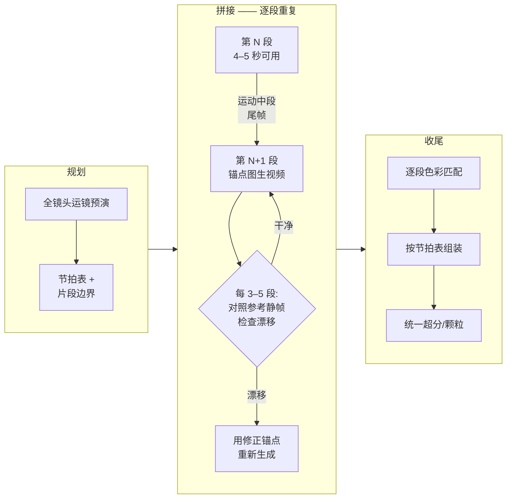

# 04 — 长镜头链式拼接:分钟级连续镜头(一镜到底)

> **这是什么:** 当目标是一个远超任何模型可靠单片时长的连续镜头——
> 2 分钟的空间漫游、10 分钟的一镜到底 MV——把镜头切成有重叠的片段,
> 用连续性锚点串起来,让拼接点不可见。

[English version](../en/04-long-take-continuous-shot.md)

---

## 什么时候用

当你的路由答案长这样时,上 T5:

- **Q1(时长):** 最终镜头是分钟级,而现有模型单遍生成撑不了这么久。
  截至 2026 年,大多数模型的可靠区间在 4–10 秒,再长就开始不稳——
  这个数字变化很快,以当前文档为准。
- **Q2(一致性):** 同一主体必须撑完全程。带锚点的链式拼接之所以优于
  一次长生成,正是因为你可以在每个片段边界重新声明身份。
- **Q3(运镜):** 镜头是一次不间断的运镜,没有任何藏切点的地方。
  这正是问题本身——链式拼接就是为了伪造"没有切"。
- **Q6(预算):** 你付得起每个最终秒 5–20 倍于单次的成本。付不起的话,
  就拍成分镜来剪——剪辑至今仍比拼接便宜。

典型目标:一镜到底 MV、生成空间的连续漫游、"伪一镜"动作镜头、长时间产品环绕。

## 什么时候不要用

- **镜头可以切成分镜。** 用六个普通镜头讲一场戏是 T0–T4 的问题。
  链式拼接只为**绝不能切**的镜头服务。导演能接受切,就切——
  你会从 T5 降回每个镜头 T1,省一个数量级。
- **模型已经能生成这个时长。** 目标 20 秒、模型稳定 20 秒,那就是 T0/T1,
  不是链。为单遍能搞定的长度硬切 3 段,是过度升级。
- **镜头里有任何能实拍的东西。** 运镜能实拍或实拍预演,就对一条连续底板
  走 T2(视频迁移)或 T3(白膜迁移),远比拼接生成片段稳定。
- **主体没有任何锚点。** 没有角色设定图、没有 LoRA、没有参考静帧——
  先补上(T1 纪律)再拼接,否则每个片段边界都是一次身份抛硬币。

## 流水线

设定一个具体目标:10 分钟(600 秒)一镜到底 MV,一名表演者,连续运镜。
以下所有数字都是**起点**,不是配方。

1. **先规划运镜轨迹,再生成任何东西。** 把 600 秒整体做成一条轨迹的分镜
   或预演——Blender 相机、动态故事板,甚至拿手机走一遍路线拍下来。
   标出每 5 秒相机在哪。每个片段边界的铁律:**运动绝不能在接缝处走到死路。**
   片段结束时相机(或主体)必须带着可见速度处于运动中段,下一段才能继承一个
   方向,而不是继承一张静止帧。静止接静止的接缝,观众看起来就是切。
2. **片段长度由模型决定,不是由音乐决定。** 片段长度设在模型可靠单片长度的
   *略下方*。模型稳在 5 秒,就按 4–4.5 秒可用长度生成,段间重叠 0.5–2 秒。
   600 秒按 5 秒一段、重叠 1 秒算,约 150 段。把这个数字写下来,它就是你的工期。
3. **把片段边界对齐到音频。** MV 的片段边界对齐到拍点或小节,并把*隐藏*接缝
   (第 7 步)放在鼓点、重拍或歌词切换处。对齐节拍一举两得:接缝节奏显得
   是设计出来的,而且瞬态音频恰好能在接缝处抢走观众的注意力。
   维护一张节拍表(BPM → 帧号),和分镜放在一起作为生产文档。
4. **锁死身份套件。** 第 1 段开始之前:已验收的角色设定图/转面图、固定的
   LoRA(如果用)、固定的种子策略(同一机位设定用同一族种子,只在片段明确
   失败时才换)、3–5 张目标风格下的主体参考静帧。全部冻结。
   这就是文档 00 的升级纪律在链式场景下的应用:已验收的产物是输入,
   绝不在下游重新生成。
5. **用锚点把第 N 段接到第 N+1 段。** 按优先级:
   - **尾帧 → 首帧:** 抽出已验收第 N 段的最后一帧,作为第 N+1 段图生视频的
     首帧。最简单,到处可用。第 2 步的重叠让你有几帧候选尾帧——
     选运动中段最清晰的那一帧。
   - **首尾帧桥接:** 工具支持尾帧的话,两端都锚定地生成第 N+1 段
     (首帧 = N 段尾帧,尾帧 = 预演里规划好的关键帧)。控制最强,
     模型自由度最小。
   - **潜变量/上下文传递:** 在 ComfyUI 里,上下文窗口采样器
     (AnimateDiff 风格的 context options)或视频续写节点可以把运动潜变量
     上下文带过边界,而不是只传一张 RGB 帧。运动连续性更好,但更吃显存、
     图更复杂——截至 2026 年,具体节点名和行为每月都在变,以当前文档为准。
6. **每几段回锚一次,对抗漂移。** 每 3–5 段,把当前帧和冻结的参考静帧对比。
   脸、服装、场景漂了,就不要再从漂过的帧继续接——用修正后的锚点重新生成
   下一段(参考静帧与当前尾帧姿态合成,或中等权重的 IPAdapter 引导)。
   漂移是复利;每 20 秒素材抓一次,远好过于结尾重拍 60 段。
7. **藏接缝。** 锚点再好也会留微跳。按优先级安排:
   - **甩镜头(whip pan):** 在边界处安排一次快速摇镜;3–6 帧动态模糊
     能遮住一切。这就是第 1 步要求接缝处有速度的原因。
   - **遮挡划变:** 让主体或前景物体在边界处掠过镜头。
   - **动态模糊帧:** 生成的运动太干净,就在后期给接缝加 2–4 帧方向性模糊。
   - **匹配剪辑:** 最后手段,在强形状匹配处切(门框接门框)。它确实是切——
     但设计过的切读起来是风格,不是失败。
8. **逐段统一色彩。** 最终组装前,把每段与相邻段做感知匹配:至少匹配接缝帧的
   直方图;更好是在 DaVinci Resolve 里逐段调色或走 LUT 链。在超分*之前*、
   在已验收的片段上做。
9. **组装,再统一收尾。** 按节拍表拼接,交叉淡化只发生在重叠窗口内;
   然后在*组装好的*时间线上做收尾(超分、颗粒、锐化),保证收尾处理
   在所有接缝上均匀一致。

## 失效模式

- **身份漂移逐段累积。**
  症状:第 8 分钟的表演者和第 1 分钟的明显不是同一个人——
  脸型、发型、服装细节在游走。
  原因:每个尾帧锚点都继承了上一段的小误差,误差是乘法累积的,永远不会
  互相平均掉。
  修法:第 6 步的回锚循环。每 3–5 段对照冻结静帧;从修正锚点重新生成,
  而不是从漂过的帧继续接。如果 2 段之内就漂,说明身份套件(第 4 步)太弱——
  停下来加强 LoRA/参考图,别再烧片段。

- **片段边界处接缝跳变。**
  症状:拼接点可见的跳变——主体瞬移几个像素、背景重新打光、纹理闪烁。
  原因:锚在了一张静止或运动模糊的尾帧上,或者零重叠硬接,
  没有候选帧可选。
  修法:锚在运动中段清晰的帧;保留 0.5–2 秒重叠,每条接缝挑最佳边界帧;
  让接缝经过遮挡手段(甩镜头、遮挡、模糊帧,见第 7 步)。修不掉的接缝,
  当初就该规划一道划变盖过去。

- **光线与色彩不连续。**
  症状:边界处曝光或白平衡跳台阶;房间主光方向在段间摆动。
  原因:每段各自从提示词里采样自己的光照;链上没有任何东西传递照明状态。
  修法:每条提示词带相同的光照描述(同一时间、同一主光方向);
  首帧锚定本身就带着上一段的光;组装前逐段统一色彩(第 8 步)。
  给调色留预算——150 段就是 150 次小调色。

- **节奏死水区。**
  症状:大段"什么都没发生"——相机在空处漂,因为为了够到下一个规划好的
  节拍,这段不得不存在。
  原因:片段数是从时长推出来的(600÷5=120),而不是从内容推出来的;
  凑数片段被生成,因为格子表上写着要。
  修法:片段边界归节拍表管,不归时钟管。某个 5 秒槽里没有规划动作,
  就改变运镜(重构图、变速、揭示新信息),或者删掉这个槽重新对时——
  绝不用没规划的生成去填时长。一镜到底里的冷场,比分镜里显眼得多。

- **链在生产中途断裂,上游工作作废。**
  症状:做到第 80 段发现第 30 段服装错了,所有锚在它上面的东西都可疑。
  原因:验收片段时只肉眼看了当前段,没对照冻结套件。
  修法:严格验收门——一段只有通过身份、光照、接缝三项对照检查才能冻结。
  绝不为修下游问题而重新生成已冻结的段;去修下游。

## 成本说明

对照假想中同最终秒数的单遍生成:

- **纯生成:** 仅重叠一项就是每秒约 1.2–1.5 倍(5 秒段重叠 1 秒,意味着
  20–25% 的生成帧被丢弃),还不算重试。
- **重试:** 每段要同时通过身份和两侧接缝验收,预计每个被接受的片段
  抽 2–4 个种子。10 分钟成片 ≈ 150 段 × 2–4 个种子。
- **漂移修正:** 预留 10–20% 的片段需要从修正锚点重新生成。
- **后期:** 逐段色彩统一加接缝处理——150 段的体量,这是以"天"计的
  剪辑工作量,不是"小时"。
- **实际总量:** **每个最终秒约 5–20 倍于单遍的算力**,外加 10 分钟目标
  对应数天的人工组装。T5 这一级,Q6 不是修辞。只播一次的片子,
  重新想想它是否必须一镜到底。

---

**上一篇:** [03 — 多步骤合成](03-multistep-video-generation.md)
**下一篇:** [05 — ComfyUI 集成模式](05-comfyui-integration.md)
