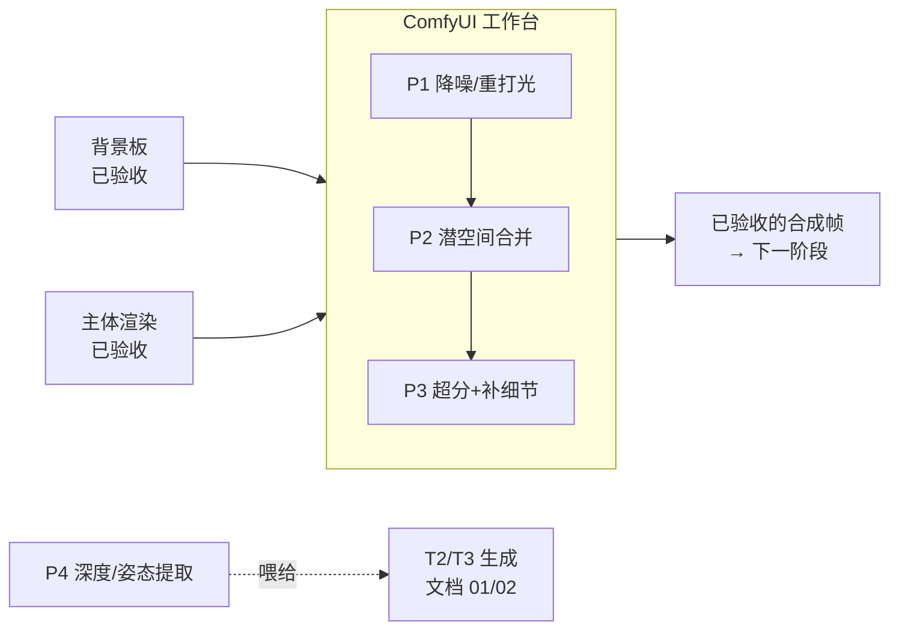

# 05 — ComfyUI 集成模式:步骤之间的工作台

[English version](../en/05-comfyui-integration.md)

在本手册里,ComfyUI 的职责是外科手术,不是从零生成。已验收的产物送到这里来
**融合、合并、超分、测量**——而不是在这里诞生镜头。本文档给出四个配方(P1–P4),
外加把它们跑在真实素材上的批处理与导出约定。

---

## 什么时候用

当你手里已经有两个或多个各自验收合格的产物,而它们之间的差距是**像素级问题**、
不是概念级问题时,才轮到 ComfyUI 上场:

- **Q4 答案是"是"** —— 主体与环境有交互,朴素贴图出现抠图边、缺接触阴影、
  光影不匹配。→ P1
- 你**有意分开生成**了背景和主体(T4),两者都已冻结。→ P1 或 P2
- 已验收的关键帧/背景板是 1024px,交付要求是 4K。→ P3
- 你正准备进入 T2/T3,需要深度图或姿态图做结构引导。→ P4

在多步链中的典型位置(见 [03](03-multistep-video-generation.md)):

## 什么时候不要用

- **还没有任何东西验收通过。** ComfyUI 的pass是打磨,不是救命。背景板本身就不对,
  就回 T0/T1 重新生成——重打光只会忠实地把一块烂板子融进一张烂合成图。
- **编辑器里一个滑杆就能解决。** 如果只是给贴上去的主体校色,曲线比 KSampler 便宜
  ——前提是无需伪造轮廓光和材质交互。先试笨办法。
- **你想在这里从零生成。** 那等于把复杂度预算又塞回单次采样——正是本仓库要防止的
  失败。生成交给外部生成器,ComfyUI 只处理接缝。
- **镜头是单条未剪辑素材、没有合成需求。** T0 通过就是做完了。不要因为图搭起来
  好玩就加一个工作台pass。

## 流水线

四个配方共享同一条纪律:**输入是冻结的产物**(文档 00 第 4 条:冻结已验收的产物),
输出必须过检才能流向下游。下面的参数都是**起点值**,不是圣旨;采样器和预处理器的行为
随版本变化,截至 2026 年,请查你的 ComfyUI 版本和节点包的当前文档。

### P1 — 管线中段降噪/重打光:把贴上去的主体融进背景板

**目标:** 拿到一张硬合成图(主体贴上背景板),让扩散模型重新整合边缘、轮廓光和
接触阴影——其他一概不动。

P1 的**安全区间是 0.15–0.4**,**默认起点是 0.25**。先检查蒙版,再在安全区间内移动:
0.15–0.2 处理颗粒/色调,0.2–0.3 处理环境色,0.3–0.4 处理更明显的光线或硬边差异。
如果超过 0.4 才能融合,应修正或重做上游主体,不要让 P1 重新设计它。

1. 在上游完成朴素合成(编辑器、Photoshop,或 `ImageCompositeMasked` 节点)。冻结它。
2. 在 ComfyUI 里:
   - `Load Image`(合成图)→ 在 **MaskEditor** 里把主体连带一圈余量涂成遮罩。
   - `FeatherMask`(外扩/羽化 8–16 px 起点),让模型接管边界,而不是你来硬切。
   - `VAE Encode` → `Set Latent Noise Mask`(接上羽化后的遮罩)。
   - `KSampler`,**默认从 denoise 0.25 起步**,低到只有遮罩区域和它的光影交互会动。
     提示词描述*光影与材质交互*("主体左侧有来自窗户的柔和轮廓光"),不要描述内容。
   - `VAE Decode` → 可选:用 `ImageCompositeMasked` 对原图合成,把被 VAE 漂掉的
     背景像素恢复回来。
   - `Save Image`。
3. 验收前检查:200% 放大看遮罩边界的接缝;接触阴影存在且合理;主体与背景板的色温
   匹配;脸部和细节与已冻结的主体渲染完全一致。

### P2 — 分生成元素的潜空间合并

**目标:** 在 decode 之前合并两个已验收的元素,让模型在潜空间里解决重叠区,而不是
你在像素空间里硬抠。

1. `Load Image` × 2(冻结的背景、冻结的主体层)→ 各自 `VAE Encode`。
2. 在图像侧做遮罩(`ImageToMask`,或 MaskEditor 手涂后按需 `MaskToImage`),
   `FeatherMask`,然后 `LatentCompositeMasked` 把主体 latent 放进背景 latent。
3. 轻量重采样缝合接缝:`KSampler` **denoise 0.15–0.3 起点**,同样用
   `Set Latent Noise Mask` 把范围限制在重叠带。
4. `VAE Decode` → `Save Image`。
5. 检查:重叠带无重影、无涂抹;两元素之间透视/比例一致;光源方向一致;遮罩外的
   背景与冻结板逐像素一致(不一致就合成回去)。

当主体边缘需要模型*生成*融合像素时(雾、亮背景前的头发、运动模糊),P2 优于 P1;
当主体已经定稿、只需要光影融合时,P1 优于 P2——P2 会重新编码主体,每次都要付出
一点细节代价。

### P3 — 已验收帧的超分+补细节

**目标:** 提升分辨率、增加微纹理,**但不改变内容**。帧已验收,这个pass不允许有
自己的想法。

1. `Load Image`(已验收帧)。
2. `Upscale Model Loader` + `Upscale Image (using Model)` —— 选保内容的超分模型,
   2× 起点。仅这一步几乎不改语义,是安全的 80%。
3. 可选补细节:对超分结果 `VAE Encode` → `KSampler` **denoise 0.1–0.25 起点** →
   `VAE Decode`。纹理从这里来——贪心的话,内容漂移也从这里来。
4. 帧超出 VRAM 时:用分块工作流(社区节点包的 tiled VAE decode / tiled upscale)。
   分块大小和节点名随包而异——截至 2026 年,查当前文档。
5. `Save Image` 输出最终分辨率。
6. 检查:100% 放大来回切换前后图——构图、脸、手、文字、logo 必须一致;新增纹理只
   出现在本该有纹理的表面(布料、植物、皮肤);硬边缘无锐化光晕。

### P4 — 为文档 01/02 提取深度/姿态

**目标:** 把参考素材或已验收帧变成 T2(深度引导视频)和 T3(白模迁移)需要的
结构引导图。只做提取,不做采样。

1. `Load Image`(参考帧)。
2. 预处理器节点——标准路线是 `comfyui_controlnet_aux` 包:
   - **Depth Anything** 出逐帧深度图;
   - **OpenPose / DWPose** 预处理器出姿态骨架。
3. `Save Image` 保存引导图(视频用 PNG 序列)。
4. 下游在文档 01/02 的生成图里:`Load ControlNet Model` → `ControlNet Apply`
   接在深度/姿态图和 `KSampler` 之间,**ControlNet 强度 0.7–1.0 起点**用于硬几何
   锁定(比如白模迁移里锁几何),想让模型有发挥空间就调低。
5. 检查:深度图近远关系正确(抽查遮挡处);主体轮廓内无空洞;姿态关节落在真实
   关节点上;序列帧之间引导图不闪烁(闪了就地修复——下游会把闪烁放大)。

### 批量处理视频帧序列

视频就是几百帧。可靠的做法:

1. 上游拆帧:`ffmpeg -i clip.mp4 frames/%05d.png`。
2. 把帧放进 ComfyUI 的 `input/` 目录。
3. 逐帧跑同一张图,只换 `Load Image` 的文件名——走 HTTP API(以 API JSON 格式
   `POST /prompt`,每帧一次调用),或用社区包的批量加载节点。API 路线无聊但可
   脚本化,优先选它。
4. `Save Image` 把编好号的结果写到 `output/`。
5. 回拼:`ffmpeg -framerate 24 -i output/%05d.png -c:v libx264 -crf 18 out.mp4`。

规则:整条序列固定种子(逐帧换种子是闪烁发生器);denoise 保持低位(漂移会逐帧
累积);每隔 N 帧抽查加首尾帧——批处理的失败是系统性的,抽样就能抓到。

### 把 workflow 导出到 `workflows/`

只活在你机器上的图不算流水线的一部分。提交约定:

1. 在 ComfyUI 里用 **Save**(workflow JSON,不只是 API 格式),保证图能加载回 UI。
2. 如果图要被脚本驱动,两种格式都导出:API 格式 JSON 给 `POST /prompt`,
   workflow JSON 给人看。
3. 文件放进 [`workflows/`](../../workflows/),命名要说清实现的是哪个配方,例如
   `p1-denoise-relight.json`。
4. 旁边配一个简短的 `.md` 说明:属于哪个模式(P1–P4)、期望的输入(背景板路径、
   遮罩约定)、构建时用的 checkpoint 家族(不钉版本号——版本敏感处注明"截至 2026
   年,查当前文档"),以及本文档对应的验收清单。

## 失效模式

- **重打光后主体边缘有一圈光晕/鬼影** → 遮罩太紧或没羽化,模型把边界描成了轮廓线
  → 遮罩外扩 8–16 px 并 `FeatherMask` 10–20 px,同 denoise 重跑。
- **主体身份漂移(换脸、服装细节变异)** → 对融合pass来说 denoise 太高 → 降到
  0.2–0.3,并把未动的背景合成回去,让模型输出只留在遮罩带内。
- **超分编造细节:文字被改写、logo 变形、脸上长出原本没有的毛孔** → 补细节pass
  有了自己的想法(denoise 太高)或超分模型本身幻觉 → 换保内容的超分模型,denoise
  上限 0.25,验收前 100% 检查文字/logo。
- **潜空间合并后重叠区涂抹** → 两个 latent 在过软过大的遮罩里打架 → 遮罩收紧到
  真实重叠带并降低重采样 denoise;仍涂抹就退回 P1(像素合成+轻度重打光)。
- **`VAE Decode` 后偏色或黑位发灰** → VAE 与 checkpoint 不匹配 → 用
  `Load Checkpoint` 自带的 VAE,别随手外挂一个。
- **批处理后帧序列闪烁** → 逐帧种子变化,或 denoise 高到每帧都在重造纹理 → 序列
  固定种子、降低 denoise;记住时序平滑是视频阶段的职责,不是这个工作台的。
- **批处理中途 OOM** → 全分辨率帧且没开分块 → 缩小输入、启用 tiled VAE,或分批跑;
  队列死在第 900/1200 帧是调度事故,不是玄学。

## 成本说明

每帧相对单次直出生成的大致倍数:

- **P1 重打光:** 约 1.2–1.5×(一次编码 + 一次低 denoise 短采样)。
- **P2 潜空间合并:** 约 1.5–2×(两次编码 + 一次轻采样)。
- **P3 超分+补细节:** 约 1.5–3×,取决于超分倍数和分块数。
- **P4 提取:** 约 0.1× —— 预处理器是廉价推理,不采样。

批量算术不讲情面:单帧成本 × 帧数。24 fps 的 10 秒镜头是 240 帧,一个"便宜"的
1.2× pass,跑一轮也约等于 290 次单帧生成。所以这些配方优先服务**已验收的关键帧
和背景板**——先跑在锚定生成的帧上,别跑在随时可能丢弃的原始素材上。

---

**上一篇:** [04 — 长镜头链式拼接(一镜到底)](04-long-take-continuous-shot.md) ·
**框架:** [00 — 决策框架](00-decision-framework.md)
