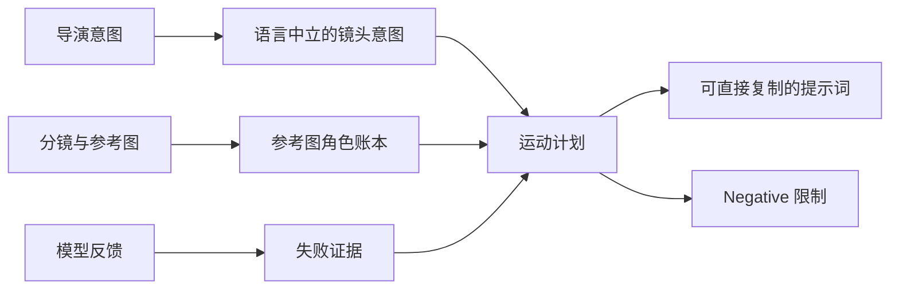

# 运动优先的提示词编译

## 用途

视频提示词本质上是一个控制编译问题。导演意图、分镜、参考图、模型反馈的
原始排列方式，并不是生成模型最容易执行的排列方式。它们需要先被归一化为
明确的参考图绑定和物理上连贯的运动序列。

这一层不是新的技术阶梯，而是横跨全部 T0–T5 的表达层。T0–T5 决定
**镜头用什么方式生产**；提示词编译决定**每一次生成该怎样表达**。



## 1. 普通提示词为什么容易失败

自然语言需求经常把几种不同层级混在一起：

- 传播目标：观众应该感受到什么；
- 物理镜头：摄影机、主体和环境具体怎样运动；
- 生产证据：哪张图控制人物、构图、动作或影调；
- 画面质感：灯光、镜头感、材质和广告片完成度；
- 失败报告：上一次生成具体错在什么地方。

把这些内容原样交给模型会产生歧义。“一位非常优雅的女孩，电影感，动态运镜”
只说出了期望印象，没有定义可执行镜头。编译器需要把“优雅”变成可见结果：
摄影机速度、体态、步伐、眼神、重心、布料反馈、视差和光线。

## 2. 中间表示

提示词在渲染为中文、英文或模型专用语法之前，应先形成一份语义结构：

```text
ShotIntent {
  communication_goal
  shot_function
  duration_and_format
  camera_motion
  subject_motion
  scene_motion
  look
  continuity
  reference_bindings
  hard_constraints
  soft_preferences
  observed_model_failures
}
```

这一步把语言与控制逻辑分开。相同镜头可以被渲染成纯英文提示词、
夹带英文制作术语的中文提示词，或某个模型的固定模板，镜头含义保持不变。

## 3. 参考图是有类型的输入

每张参考图都必须拥有明确身份。一张图可以同时承担多个角色，但不能静默推断。

| 参考图角色 | 控制内容 |
|---|---|
| 首帧 / 中间帧 / 尾帧 | 某个明确时刻的空间状态 |
| 构图参考 | 布局、平衡与 blocking |
| 机位参考 | 视点、高度、镜头感或摄影机路径 |
| 动作参考 | 姿势、手势、步态或运动路径 |
| 影调参考 | 灯光、色彩、反差与质感 |
| 人物绑定 | 面部、身体身份、轮廓或角色设计 |
| 服装参考 | 服装、造型、配饰与材质 |
| UI / 包装参考 | 界面、包装、标签、Logo 与图形系统 |

最关键的规则是：

> 构图参考图不是首帧或尾帧，除非导演明确赋予它额外的帧锚点身份。

如果参考图角色不明确，并且会实质改变生成结果，编译器应在写提示词前只追问
一个范围很窄的问题。

## 4. 运动是提示词的优先栈

正向提示词采用固定顺序：

```text
参考图绑定
→ 摄影机运动
→ 主体运动
→ 场景运动
→ 影调与拍摄质感
→ 连续性限制
```

### 摄影机运动

只写决定镜头的变量：机位高度与角度、景别、路径、轴线、方向、速度、
加速度、稳定方式和主导运镜。需要时再加入手持幅度、footstep bounce、
horizon roll、甩镜特征和 motion blur。

通常“一种主运镜 + 一种辅助运动”比堆满摄影术语更清楚。互相矛盾的摄影机运动
必须在编译阶段消解，不能原样传给模型。

### 主体运动

明确主体方向、速度、步伐节奏、重心转移，以及必要的手脚、躯干、表情、
眼神和起止状态。使用可见的动作动词，不要停留在表演形容词。

### 场景运动

把环境反应独立描述：头发、衣料、雨、烟、人群、反射、屏幕、接触效果，
以及前景与背景视差。它的时机和强度应与摄影机和主体速度一致。

### 影调

运动解决后，再添加光线方向与软硬、反差、色彩、曝光特征、镜头质感、
景深、快门感、颗粒、材质真实度和广告片完成度。

## 5. 正向提示词与 Negative

正文用于描述想要的行为。可以改写成正向控制时，不使用否定：

```text
不要写：no shaky camera
改成：stable low-amplitude handheld follow
```

无法正向表达的失败限制统一进入一行 `Negative:`，例如人物漂移、肢体错误、
意外切镜、时序闪烁、画面扭曲、文字不可读或其他模型特有风险。
Negative 不应重复正文。

默认交付契约保持极简：

```text
<一整段可直接复制的正向提示词>
Negative: <紧凑的失败限制>
```

除非用户要求，否则不输出分析过程、备选版本、参数表或开场说明。

## 6. 根据模型反馈修订

把失败结果当作某一控制层的证据：

| 可观察失败 | 优先修改 |
|---|---|
| 机位或摄影机路径错误 | 摄影机条款 |
| 动作弱、模糊或不连续 | 主体运动条款 |
| 头发、衣料、雨或视差不动 | 场景运动条款 |
| 人物或服装漂移 | 参考图绑定与连续性 |
| 灯光或质感错误 | 影调条款 |
| 闪烁、扭曲、重复肢体 | Negative；持续失败时升级技术阶梯 |

只有一个层级失败时，不要重写整条提示词。已经通过的条款应当像仓库中的
已验收资产一样被冻结。

## 7. 验收

提示词交付前检查：

1. 每张参考图都有明确角色。
2. 构图参考没有被擅自升级为帧锚点。
3. 摄影机、主体、场景、影调按固定顺序出现。
4. 摄影机运动在物理上兼容。
5. 动作具备方向、时机和连续性。
6. 每个形容词都改变一种可见属性。
7. 压缩后仍保留全部硬约束。
8. Negative 是失败控制，不是第二条提示词。
9. 输出不需要二次删改即可复制。

## Agent 实现

可执行行为封装在
[`compile-video-prompt`](../../skills/compile-video-prompt/SKILL.md) 中。
其规范使用英文编写，只在 Skill 被调用时加载。公开手册解释方法，但不逐字保存
某个私人 ChatGPT Project Instructions，也不绑定某一种聊天产品。
