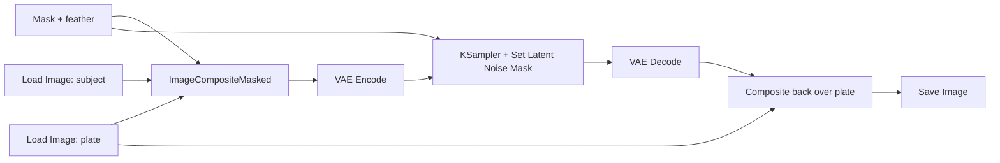

# ComfyUI Denoise/Relight Pass

A surgical pass, not a generative one. The goal: make a pasted subject sit in the
plate's lighting without repainting it. This is the merge step of T4 multistep
compositing — it fixes the seam between two already-approved artifacts. It does not
fix bad artifacts.

## Step 0: Read the framework first

Before building anything, read `../../docs/en/05-comfyui-integration.md` for where
this pass lands in a chain, and confirm:

1. Both inputs are **frozen, approved artifacts** — the background plate and the
   subject cutout. If either one is still being regenerated, stop. A denoise pass on
   moving inputs wastes compute.
2. A cheaper fix does not apply. If the mismatch is only brightness/contrast, grade in
   an editor. Run a diffusion pass only when light direction, ambient color, or texture
   grain must change.

## Step 1: Build the node graph

Standard order, real node names:

1. `Load Image` — the plate.
2. `Load Image` — the subject cutout (already masked; alpha or separate mask).
3. Mask prep: `Load Image (as Mask)` or `Image To Mask`, then feather with a
   mask-grow/blur node (e.g. `Grow Mask` + `Mask Blur`, or equivalent feather nodes).
4. `ImageCompositeMasked` — paste the subject onto the plate at its final position.
5. `VAE Encode` — composite → latent.
6. `KSampler` — denoise pass, masked to the subject region (use `Set Latent Noise Mask`
   or inpaint-mask input so the plate outside the mask is untouched).
7. `VAE Decode` — latent → image.
8. Composite the result back over the original plate with the same mask, so untouched
   plate pixels stay bit-identical.
9. `Save Image` / `Preview Image` — inspect before approving.

Keep steps and CFG the same as the pass that generated the subject, unless you have a
reason to change them. Denoise strength is the knob; everything else is scaffolding.

## Step 2: Pick the denoise strength

Denoise strength trades identity preservation against blending force. The P1 safe
envelope is 0.15–0.4, and the default starting point is 0.25. Tune per shot, and check
current ComfyUI docs since sampler behavior is version-sensitive.

| How far is the subject from the plate? | Starting denoise | What it does |
|---|---|---|
| Slight grain/tone mismatch; light direction already matches | 0.15–0.2 | Re-grains and color-ties; identity essentially untouched |
| Ambient color clearly off (warm plate, cool subject) | 0.2–0.3 | Relights and re-grades; minor texture softening |
| Light direction differs, or hard edge mismatch | 0.3–0.4 | Repaints surface lighting; expect identity drift, verify |
| Needs more than 0.4 to blend | — | Wrong fix. The subject was generated wrong; go upstream and regenerate it with the plate's lighting in the prompt |

Never start at the top of the range. Start low, look, raise.

## Step 3: Feather the mask

Feather width is set in pixels of the working resolution, not percent.

- Sharp-focus subject, hard silhouette: 4–8 px.
- Normal photographic edge: 8–16 px.
- Soft/defocused subject or hair: 16–32 px, and accept that the pass will do the blending.
- Rule of thumb: the feather should roughly match the edge's blur width in the plate.
  A feather wider than the subject's smallest feature (fingers, props) will smear that
  feature — the pass starts repainting outside the subject.

## Step 4: Inspect for artifacts

Zoom to 100% at the seam and check, in order:

- **Edge halos** — a light or dark ring along the mask boundary. Feather too narrow, or
  denoise too low for the mismatch.
- **Texture washout** — subject looks airbrushed, grain gone. Denoise too high, or
  steps too low for the denoise value.
- **Identity drift** — face, logo, or pattern changed. Denoise too high, period.
- **Double edges** — old outline ghosting under the new one. Mask not covering the
  full pasted region; fix the mask, not the denoise.
- **Plate changed outside the mask** — the noise mask was not applied; re-check
  `Set Latent Noise Mask` wiring.

## Step 5: Iterate

- Identity drifted → lower denoise by ~0.05.
- Seams/halos remain → raise denoise by ~0.05, or widen the feather.
- Both at once → the mask is wrong (usually too tight); fix the mask before touching
  denoise again.
- Two failed iterations at the same setting → the inputs are too far apart. Stop and
  regenerate the subject with the plate as lighting reference instead of pushing
  denoise past 0.4.

When a pass passes inspection: **freeze it.** Save the image, and treat it as a fixed
input to any downstream pass (upscale, video generation). Never re-run the denoise
downstream of an approved artifact.
